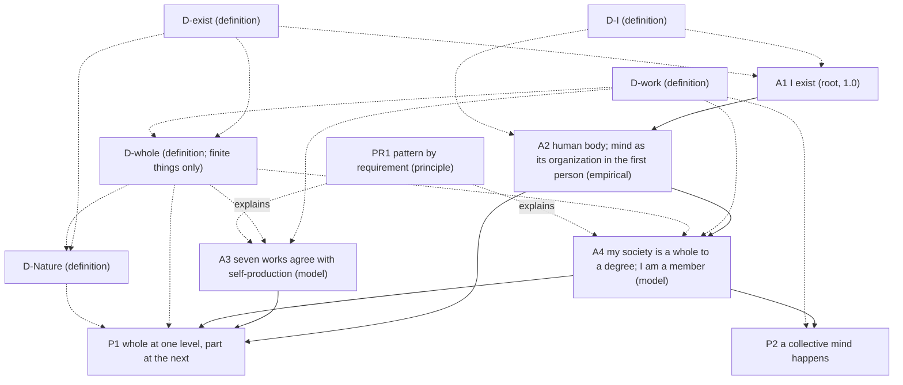

# Core v2 (candidate): the core rebuilt from "I exist"

**Status.** Candidate only. Nothing here is in `entries/`, nothing here has been scored, and nothing here changes `entries/`, `lens_test/`, `results/` or the verse drafts. Every confidence except A1's reads "pending (collider)". Built 2026-09-29 PT at the author's request: start over from the ground up, with A1 reduced to "I exist" and "human" moved into A2. Second round, the same evening: the author accepted A2, asked for a collision on Nature ([collision_nature.md](collision_nature.md)), and asked for definitions of "I" and "exist" so that A1 re-enters the chains (D-I, D-exist, D-Nature; section 3, second round).

## 1. The order

Twelve entries, plus one collision. Spinoza's layout is kept: the definitions come first, then A1, then the rest. The definitions were worked out backward, from what the later claims needed a word to mean, and then placed before the claims that use them (HOW_THIS_BOOK_IS_BUILT.md, section 5). A1 now uses two defined words, "I" and "exist", so it stands after the definitions. It is still the first claim and the only root.

| # | Entry | Kind | Statement (one line) | Rests on |
|---|---|---|---|---|
| 1 | [D-I](D-I.md) | definition | "I", used in a thought, names whatever is doing that thought: a thinker, if there is one distinct from the thinking, or else the thinking itself. | (definition) |
| 2 | [D-exist](D-exist.md) | definition | A thing exists at a time when it is going on (an activity) or present (not an activity) at that time; it lasts when it goes on existing (duration, E2D5). | (definition) |
| 3 | [D-work](D-work.md) | definition | A work is an activity that helps keep a thing's organization going and is kept going by it; a thing performs it *as one* if taking the thing apart, members left alive, would stop it; the seven works are boundary, control, energy, transport, signaling, defense, memory. | (definition) |
| 4 | [D-whole](D-whole.md) | definition | For finite things only (E1D2): grade each work 0, 1 or 2; a thing's degree of wholeness is its lowest grade; it is a whole if its degree is above zero; a member shares the whole's fate and takes part in its works; a thing produces itself if its own processes make and replace its components (defined without the seven works). | uses D-exist, D-work (Definition 11 uses neither the works nor the grades) |
| 5 | [D-Nature](D-Nature.md) | definition | Nature taken as one is everything that exists, conceived as one, with nothing besides it; it is not finite, so D-whole does not grade it; everything is in Nature, and being in Nature is not being a member. The identification with Spinoza's God is a declared reading, unscored. | uses D-exist, D-whole; result of [collision_nature.md](collision_nature.md) |
| 6 | [A1](A1.md) | root, 1.0 | I exist. (In defined terms: whatever is doing this thinking is going on, or present, now.) | nothing: doubting it is a case of it; uses D-I, D-exist |
| 7 | [A2](A2.md) | axiom, empirical | I am a human body made of cells, and my mind is that same body's organization described in the first person. | A1 (its subject; caps nothing) and its own evidence (clause a); clause b is a declared reading, unscored |
| 8 | [A3](A3.md) | axiom, model | The seven works sort things the way self-production does: what produces its own parts performs all seven as one; what lasts without producing its own parts fails at least one. | anchors, negative controls, hard cases |
| 9 | [PR1](PR1.md) | principle | Where the same requirement holds, the same work turns up, in forms that differ completely from level to level. | explains; adds no confidence |
| 10 | [A4](A4.md) | axiom, model | The society I live in is a whole to a degree, judged one work at a time, and I am one of its members. | its own evidence, row by row; A2 for the membership clause |
| 11 | [P1](P1.md) | proposition | I am a whole at one level and a part at the next. | A2, A3, A4 |
| 12 | [P2](P2.md) | proposition | A collective mind happens in the society I live in: control performed as one, combining signaling and memory; an activity, not a thing, and not a claim that the society feels. | A4 |

Definitions are numbered straight through: D-I is Definition 1, D-exist 2, D-work 3–6, D-whole 7–11, D-Nature 12. Every cross-reference in core v2 was renumbered to match.

[collision_nature.md](collision_nature.md) is not an entry. It is the written judgment between the two readings of Nature that produced D-Nature, D-whole's domain clause, and the new P1, Scholium 3.

## 2. Citation graph

Solid arrows carry support, and so caps. Dotted arrows show definitions used, or explanation. They carry no confidence. The edges from D-I to the entries that say "I" beyond A1 and A2, and from D-exist to A3, PR1 and P2, are listed in each entry's `terms` and left out of the drawing to keep it readable.

**Caps (METHOD.md, rule 1).**

- A1 = 1.0.
- A2 = its clause (a) evidence. The cite of A1 caps nothing.
- A3 = its weakest anchor, control or hard-case result.
- A4 = its weakest row, and no more than A2, which its membership clause cites.
- P1 ≤ min(A2, A3, A4). Its "whole" half alone ≤ min(A2, A3).
- P2 ≤ the weakest of A4's control, signaling and memory rows, and, through A4's membership clause, no more than A2. A2 is not expected to bind.

Every chain of support now ends in the root or in evidence an axiom carries itself, as HOW_THIS_BOOK_IS_BUILT.md, section 3, says. Every chain that uses "I" passes through A2 to A1.

**Does A1 now do real work?** Yes. The work is logical, not evidential.

1. *A1 supplies the subject A2 identifies.* A2 says what the I is. That is an identity claim, and it needs an I that exists. A1 is the premise that there is one, and D-I says what the word names. Without A1, A2's "I" could fail to name anything.
2. *A1 does not supply sameness over time.* This is where the honest answer is narrower than the author's suggestion. P1 needs the I that is a whole (A2) to be the I that is a member (A4). D-I names only the doer of *this* thought, and A1 holds only "for as long as I am thinking". So A1 cannot carry the same I from one entry to the next. A2 carries it, on evidence, by identifying the doer with one lasting body. Tracing this showed that A4's membership clause (my food, my public health, my work) is about that body, so **A4 now cites A2**, and P1, step 6, states the identity outright.
3. *A1 adds no confidence and removes none.* At 1.0 it caps nothing. What it adds is that the chains are valid: every "I" names something, and the chains end at the root as HOW says they do.

So A1 re-enters the chains through one solid edge, A1 → A2. Every chain that uses "I" reaches it: A4, P1 and P2 through A2. Chains that do not use "I" (A3's) end in evidence, as before.

## 3. What changed from the current entries, and why

| Current entry | In core v2 | Why |
|---|---|---|
| A1 "I, a human, exist." | **A1** "I exist." | The certainty (doubting it is a case of it) covers only that something is thinking now. "Human" is a fact about what I am, known on evidence, so it moves to A2. A side effect the author noted: A1 now fits any thinker, an AI included; the chains split at A2. |
| A2 "... that organization produces my mind." | **A2** "... my mind is that same body's organization described in the first person." | "Produces" posits a second thing caused by the first, which the evidence (the mind varies with the body) does not show. Following Spinoza (E2P7 Scholium, E2P13, E3P2 Scholium), mind and body are one thing described two ways. The evidence fits both readings, so clause (b) is declared, not scored. "First person / third person" replaces "inside / outside" everywhere. Why anything is felt stays undecided and is stated as A2's limit. |
| D-whole (filter + shared fate, no zero) | **D-work** + **D-whole** | The earlier D-whole had degrees but no zero, so it ruled nothing out. Now each of seven works is graded 0/1/2 and the degree is the lowest grade. Zero is the absence of a work, not a chosen cutoff, so the stone, the hurricane and the archive can come out as not wholes. "Filter" became the boundary work; "shared fate" became condition (a) of membership; "membership by function, not origin" is kept with its sources. *Work* is defined in the organizational sense (Mossio, Saborido & Moreno 2009), and *as one* is given a test (the take-apart test). |
| A3 "Society exhibits organism-level properties across seven rows." | split: **A3** (the measure works) and **A4** (society) | The old A3 did two jobs: testing the rows, and claiming them for society. Its failure test judged controls "by D-whole's own test", which was nearly circular. The new A3 tests the seven works against an independent standard, self-production (Maturana & Varela 1980), on anchors, negative controls and hard cases, with three stated ways to fail. Society gets its own entry. |
| PR1 "Pattern by requirement" | **PR1**, restated | Once a whole is *defined* by the seven works, "a whole must perform the seven works" is true by definition and empty. So the requirement thesis is now stated about self-producing things, with one requirement per work. Requirement (conditional) vs necessity (modal) is kept. It still adds no confidence. |
| A4 "I function within that society as a unit analogous to a cell." | **A4** (society, row by row, with me as a member) and **P1** | The sketch's A5 (society by degree) became A4, because the sketch's A4 ("a whole at one level and a part at the next") is derived and needs the society claim as a premise. So the sketch's A4 is now a proposition, P1, with a written demonstration. "Analogous to a cell" is dropped: P1 says *member*, which D-whole defines, and Scholium 2 says how a person is unlike a body cell. |
| P1 "a collective mind happens in society" | **P2** | The old argument ("cells produce a mind, persons are organized the same way, so a collective mind") would, under the new A2, carry the first-person clause across to the society and claim more than the evidence gives. P2 defines *collective mind* as control performed as one by a society (control, by definition, combines signaling and memory) and derives it from A4's rows. "Process, not a thing" now follows from the definition of a work as an activity, so the whirlpool image is no longer needed. Whether a society feels is left undecided, with Spencer and Spinoza on the two sides. |

### Second round (after the author's answers, 2026-09-29 PT)

| Where | Change | Why |
|---|---|---|
| A2 | Wording accepted as is. It now cites A1, and one bullet was added to clause (a): *this body* is the one the thinking goes with (closing these eyes ends my seeing). | The author accepted the wording. The cite and the bullet close the gap between A1's I and this body, which A2 had assumed without evidence. |
| **D-I** (new) | "I", used in a thought, names whatever is doing that thought: a thinker, or else the thinking itself. | So that A1 is built from defined terms. It allows Lichtenberg's point and is not defined through awareness, so it fits an AI and says nothing about feeling. |
| **D-exist** (new) | To exist at a time is to be going on, or present, at that time; to last is to go on existing. | So that A1's "exist" cannot be read in Spinoza's stronger senses (E1D1, E1D8). It also fixes "persistence", "last" and "exists as an activity exists", used in D-whole, A3, PR1 and P2. |
| A1 | `terms: [D-I, D-exist]`; restated in defined terms; noted as not true by definition. Now cited by A2. | A1 re-enters the chains, doing logical work rather than evidential work (section 2). |
| **D-Nature** (new) | Nature taken as one: everything that exists, conceived as one, with nothing besides it. It is not finite, so it is not graded. Being *in* Nature is not being a *member*. God is a declared reading. | The result of [collision_nature.md](collision_nature.md). |
| D-whole | Domain clause: finite things only (E1D2). Definitions renumbered 7–11. | Grading Nature 0 was a false zero. The tests assume something besides the graded thing. |
| A4 | Now cites A2 for its membership clause. | The I that depends on the society's food and public health is a body, so that clause rests on A2. This was found while tracing where A1's I goes. |
| P1 | New step 6 (the same I is the whole and the member); Scholium 3 rewritten (the levels stop short of Nature; the old "grade 0" withdrawn). | P1 needs one I in both halves, and A2 carries it. |
| P2 | Step 5 uses D-exist. The cap notes A2, through A4. | Follows from the A4 change. |
| All | Definitions renumbered straight through, 1–12. | D-I and D-exist come first. |

**Mapping from the agreed sketch.** Sketch A1 → A1. Sketch A2 → A2 (wording: "described in the first person" instead of "described from within", to keep "inside/within" out of the felt side). Sketch A3 → split into D-whole (the definition half: "a whole is whatever does the works of lasting as one, to the degree that it does") and A3 (the model half: the seven works pick out the right things). Sketch A4 → P1. Sketch A5 → A4.

## 4. Key design decisions

1. **A1 is deliberately thin, and now built from defined terms.** It says that I exist and nothing about what I am, for how long, or for whom beyond me (A1 scholia; Descartes, Lichtenberg). D-I and D-exist fix its two words at their thinnest, so A1 stays certain and still fits an AI.
2. **Evidence and reading are separated in A2.** Clause (a) is scored; clause (b) is declared and adds nothing.
3. **Definitions carry the tests, axioms carry the claims.** "What a whole is" is a definition; "the definition sorts real things right" is a claim that can fail (A3).
4. **An independent check against circularity.** The seven works are checked against self-production, which is defined without them. The anchors passing is expected and weak; the negative controls and hard cases (candle flame, virus, mature red blood cell, bacterial transport) carry the test.
5. **A true zero, and no cutoff above it.** The degree of wholeness is the lowest of seven coarse grades, reported with its profile. Degree of wholeness and confidence are kept as separate numbers.
6. **"As one" has an operational test.** Take the whole apart, leaving its members alive; if the activity at the whole's scale stops, the whole was performing it. This is how "performed by the collective, not only by members separately" becomes checkable.
7. **"Performed" everywhere, "must" only in PR1.** No entry claims a requirement except PR1, and PR1 scores nothing.
8. **Collective mind by definition, not by analogy.** P2 names an activity and derives it; it claims nothing about feeling.
9. **Each entry does one job.** Twelve entries against the current seven. The old A3 did two jobs and is split into a test (A3) and a society claim (A4). "Work" needed its own definition. D-I and D-exist give A1 defined terms. D-Nature gives Nature an entry of its own. The seven works, grades, membership and levels live in definition entries rather than being spread across the axioms.
10. **Nature is outside D-whole, not at its bottom.** D-whole grades finite things only. Nature taken as one gets its own definition, and a relation of its own (*in*, not *member of*). This keeps D-whole's zero honest and keeps E1D7's line clear between the constrained things D-whole grades and the one free thing it does not (D-Nature, Scholium 4).
11. **A1's work is logical.** A1 supplies the subject that A2 identifies. Sameness of the I across entries is carried by A2, on evidence, not by A1 (section 2).

## 5. Open questions for the author

1. **Clause (b) of A2.** *Resolved:* the author accepted A2's wording as is.
2. **Self-production as the independent check.** Are you content to anchor A3 on Maturana and Varela's autopoiesis, and to count multicellular organisms as self-producing (which Maturana and Varela themselves left open)? The alternative is a different independent check, or none, in which case A3's failure test is circular again.
3. **The seven.** Miller has more subsystems (the reproducer, the timer and others). Keep the seven as a selection the book owns, or add any? Adding a row can only lower A4.
4. **Three grades.** Is 0/1/2 fine enough, or do you want finer grades once graders are shown to agree?
5. **The mature red blood cell.** The core predicts it is a member of the body but not a whole in its own right (memory 0). Are you comfortable with that consequence? It is the case most likely to split graders.
6. **Which society.** A4 is read as a present-day state society. Should the book also claim anything for smaller societies, or for humanity as a whole?
7. **P2's name.** "Collective mind" now means only control performed as one, combining signaling and memory. Keep the name, given that it invites the stronger reading P2 disclaims?
8. **Whether a society feels.** P2 leaves it undecided between Spencer (no corporate consciousness) and Spinoza (all individuals animated in different degrees). Is undecided your position, or do you want to lean?
9. **Promotion.** If accepted, these would replace the current seven entries in `entries/` and need rescoring by the collider; HOW_THIS_BOOK_IS_BUILT.md and METHOD.md name A1 as "I, a human, exist" and describe the old A3/A4/P1 chain, and would need matching edits. Nothing has been changed there.
10. **Kisner page numbers** for every Spinoza citation, pending your copy.
11. **A1 in the chains.** *Resolved by the second round:* A2 cites A1, and every chain that uses "I" reaches A1 through A2 (section 2). This needs a change to HOW's rule for empirical axioms (section 5a, item 1). Do you accept it?
12. **Nature.** *Resolved by [collision_nature.md](collision_nature.md):* Nature taken as one is not graded by D-whole, and has its own definition (D-Nature). Open: should Spinoza's stronger claims, that everything is in God in his sense of "in" (E1D5, E1P15) and that Nature is God as E1D6 defines God, stay a declared reading in D-Nature, or become an entry of their own? HOW has no kind for a claim that is neither self-evident nor scored on evidence.
13. **A4 cites A2.** Tracing A1's I showed that A4's membership clause is about a body, so A4 now cites A2. That formally caps A4, and through it P2, by A2. A2's clause (a) is expected to be high, so the cap should not bind. The alternative is to move the membership clause out of A4 into P1. Keep it in A4?
14. **Sameness of the I.** D-I names the doer of one thought, and A2 carries the same I across entries on evidence (one lasting body). Is that the division of labour you want? The alternative is to put sameness into D-I, but then A1 would claim more than doubting shows.
15. **The order.** A1 now stands after the five definitions, in Spinoza's layout, and is the first claim rather than the first entry on the page. The alternative is D-I, D-exist, A1, and then the other definitions. That keeps A1 near its two terms, but it mixes definitions and claims.
16. **"Present" in D-exist.** "Going on (an activity) or present (not an activity)". Is "present" plain enough, or do you want another word?

## 5a. Implications for HOW_THIS_BOOK_IS_BUILT.md (not edited)

HOW describes the current `entries/`, so it has not been changed. If core v2 is promoted, these edits would be needed:

1. **Section 2, empirical axiom.** "It cites no other entry" becomes "It cites no other entry except the root, for its subject. The root caps nothing, so the evidence written into the axiom still carries its whole score."
2. **Section 2, root.** "A1, 'I, a human, exist.'" becomes "A1, 'I exist,' stated in two defined terms (D-I, D-exist). The definitions say what the words mean. The doubt shows that something answers to them."
3. **Section 2, definition.** Add D-Nature as an example of a definition that marks the edge of another definition's domain: D-whole grades finite things only, and Nature is not finite.
4. **Section 3.** "Each chain ends in one of two places: the root (A1), or evidence the entry carries itself" is true again. Add: "Every chain that uses 'I' reaches the root through A2."
5. **Section 5 (order).** Definitions come first, including D-I and D-exist, which A1 uses. A1 is the first claim, not the first entry on the page.
6. **A kind for declared readings.** A2's clause (b) and D-Nature's identification with God are both *declared readings*: stated, not derived, and not scored. HOW could name this as a kind, with its limit: a declared reading adds no confidence to anything.
7. **How to read "whole" and "part".** A reader should be told that the book's "whole" is narrower than Spinoza's. For Spinoza, Nature is the whole most of all (Letter 32). For the book, a whole is a finite thing that lasts by its works. "In Nature" and "member of" are different relations.

## 6. Strict nonsense self-check

Run over all nine entries and this README after the first full draft, for: empty profundity, internal contradiction, overclaiming, muddled metaphor, factual slips, "must perform" vs "performed", "inside" used for place and for the felt side, and aiming (teleological) language. Every quotation was re-checked: Spinoza against `sources/spinoza/ethics_elwes_1883.txt`; Descartes against the Cottingham and Oxford translations (AT VII 25, 27); Lichtenberg against the German text of K 76; Spencer against the Econlib text; Mossio, Saborido & Moreno's conditions against the published wording; Maturana & Varela's definition against two independent reproductions.

### Caught and fixed

| # | Where | Problem (category) | Fix |
|---|---|---|---|
| 1 | A1, "Why it is certain" | Said "a thought going on now is enough for a thinker now", then quoted Lichtenberg, whose point is exactly that thought does not give a thinker. (contradiction) | Now: doubting is going on, so *something* exists, at the least the doubting; "I" names no more than that. |
| 2 | A1, confidence | "whose denial would be an instance of it" (the denial is an instance of thinking, not of the claim). (muddle) | "whose denial, made by me, proves it". |
| 3 | A1, "for whom" | "Not evidence to a reader that I exist" (reading the book *is* evidence the author existed). (factual slip) | "A reader has only evidence that I exist, not certainty." |
| 4 | A2 | Cited A1 as a support, against HOW's rule that an empirical axiom cites no entry, while A1's own text says it lends no evidence. (inconsistency) | `cites: []`; the "I" is marked as A1's subject; graph edge made dotted; open question 11. |
| 5 | A2, lesion evidence | "Damage to a specific structure takes away a specific ability": causal wording from body to mind, which clause (b) and E3P2 deny. (contradiction) | "Where a structure is damaged, an ability is gone", plus: read by clause (b), one event described twice. |
| 6 | A2, reading | "Every mental ability varies with the organization", from two lesion cases. (overclaim) | "its mental abilities vary with ..."; the two cases are called two classic cases of one pattern. |
| 7 | A2, Spinoza | "E2P7, *because* [Scholium]" and "E3P2, *since* [Scholium]": the scholia are not the proofs of those propositions. (factual slip) | "and in the Scholium, ...". |
| 8 | A2, choice of reading | "Two descriptions ... posit nothing further" (they posit an identity). (overclaim) | "posit no second thing. This is a reason of economy, not evidence." |
| 9 | A2, limit | "names *where* the felt side is found": place language for the felt side. (inside/place slip) | "says which description feeling belongs to". |
| 10 | A2, AI scholium | "A2 is where the author's chain becomes the author's." (empty profundity) | "A2 is the first entry whose evidence is about one particular kind of thing." |
| 11 | A2, H.M. | "both medial temporal lobes were removed" (tissue was removed from the medial temporal lobe on each side, not whole lobes). (factual slip) | Reworded. |
| 12 | D-whole, Def. 9 | "a whole in its own right (most of my cells)": by count most of the body's own cells are red blood cells, which D-whole itself says are not wholes. (factual slip, contradiction) | "a nucleated cell of mine", with the count stated. |
| 13 | D-whole, Def. 10 | Said the society is "at the next level after" me "with groups and organizations between", while defining "next level" by direct membership, which I have. (contradiction) | Levels made explicitly relative: society and my groups are both at the next level up from me; P1, Scholium 1, matched. |
| 14 | D-whole, Scholium 2 | Said the old D-whole made "every lasting thing a whole to some degree" (it said only that wholeness had no zero). (overclaim about the old text) | "gave no zero, so the definition ruled nothing out." |
| 15 | D-work, Scholium | "C3 is met by anything that performs all seven works": asserted, not shown. (overclaim) | "roughly what performing seven distinct works amounts to; not tested separately." |
| 16 | D-work, Def. 3 | "The heart's pumping is the standard example." (unsourced) | Attributed as Mossio and colleagues' own example. |
| 17 | A3 / PR1 | Self-production was defined inside an axiom (A3) and borrowed by PR1: a definition hiding in a claim. (form) | Moved to D-whole, Definition 11, still defined without the seven works. |
| 18 | A3, anchors | Counted multicellular organisms as self-producing without noting that Maturana and Varela left this open. (overclaim) | "A caution on the anchors", with the 1987 source; open question 2. |
| 19 | A3 | Hard cases tested only the too-loose direction (F2). (one-sided test) | Added bacterial transport by diffusion as the too-strict case (F1). |
| 20 | PR1 | "a whole must perform the seven works": true by definition once D-whole is defined by the seven works. (empty) | Thesis restated about self-producing things; the memory requirement made concrete ("keep a record of how its parts are made") instead of the near-tautology "to use the past it must store it". |
| 21 | PR1, "what would count against it" | "a whole that loses one and goes on lasting as one": by D-whole such a thing is no longer a whole, so the case cannot occur. (contradiction) | "a self-producing thing that loses a work and goes on producing itself". |
| 22 | A4, boundary | "Dissolve the state and no one sorts what crosses" (neighbouring states still do). (overclaim) | "no one sorts what crosses on the society's behalf". |
| 23 | A4, signaling | "the channels ... go dark". (metaphor) | "stop". |
| 24 | P1, cap | "its first half is stronger than its second": the cap rule gives only "no weaker". (overclaim) | "can be no weaker than". |
| 25 | P1, Scholium 3 | "D-whole cannot grade nature": it can, and the grade is 0. (muddle) | Nature gets 0 on boundary and energy, so it is not a whole in the book's sense; flagged as open question 12. |
| 26 | P2, statement vs. step 4 | Statement said "to the degree that it performs control"; step 4 set the degree by the lowest of three rows, and argued it by an unsupported claim that control "cannot be performed further than" its inputs. (inconsistency, overclaim) | Statement now names control with the signaling and memory it uses; step 4 uses the lowest-grade rule of D-whole, Definition 8. |
| 27 | P2, Scholium 2 | "On Spinoza's view a society's organization would also have its idea": assumes a society is a Spinozan individual. (overclaim) | "on his terms, if a society is an individual, there is an idea of it too." |
| 28 | P2, Scholium 3 | "argues from the control row alone" (it uses three rows). (inconsistency) | Corrected. |
| 29 | P2 / README | "control takes up the other two" (vague). (muddle) | "combines". |
| 30 | README, design decision 9 | Claimed "fewer entries": core v2 has nine, the current set seven. (factual slip) | Says nine against seven, and why the two were added. |
| 31 | README | "separated inside A2", "thin on purpose". (inside/aim wording) | "separated in A2", "deliberately thin". |

**Sweeps with no remaining hits.** "must" appears only in PR1 (and in README text quoting it). "inside" is not used in any entry except where A2 says the book does not use it. No entry uses "aim", "purpose", "goal", "in order to", "so that" or "needs" of a whole or a work; D-work states that "contributes" is causal and implies no aim. The whirlpool image is gone. "Produces" is used of self-production and of the reading A2 declines, never of mind.

### Left open (not fixed, stated so the author can decide)

- **The stone's "conflict dimension".** The old open item dissolves: conflict is now one reason a grade is held at 1, and the stone gets 0 on boundary and energy before conflict arises. Confirm.
- **F3 has no number.** "Graders often disagree about whether a grade is zero" should become a stated agreement rate once the collider exists.
- **Maturana & Varela page.** The definition is quoted as on pp. 78–79 of the 1980 volume; reproductions differ between p. 79 and pp. 78–79. Check against a copy.
- **Miller.** The subsystem grouping follows the sourced A3 isomorphism table; Miller's book itself was not re-read for this draft.
- **Expected grades are guesses.** A4's "several rows will likely be graded 1" and A3's predicted zeros are predictions, not results. Nothing here is scored.
- **Kisner pages** for every Spinoza citation, pending the author's copy.

### Second round (collision, D-I, D-exist, D-Nature, and the edits they caused)

Run over collision_nature.md, D-I, D-exist, D-Nature, and every changed passage of A1, A2, A4, P1, P2, D-whole and this README, in the same categories and sweeps as the first round. New quotations were re-checked. Spinoza's *Ethics* was checked against `sources/spinoza/ethics_elwes_1883.txt`, with the Latin checked in `ethica_latin.txt`: E1P12, E1P13, E1P15 Scholium (*modaliter tantum distinguuntur, non autem realiter*), E2 Lemma 7 Scholium (*totam naturam unum esse Individuum*), E4 Preface (*Deum seu Naturam*), E4P4 (*Fieri non potest ut homo non sit Naturae pars*) and its Demonstration (*Dei seu Naturae*). Letter 32 was checked in Elwes's text of the letters, and its date and Latin against the Huygens *Oeuvres complètes*, vol. V, no. 1498. Letter 64's Latin and its date were checked against Camerini & Di Corato (2026). Descartes was checked against the CSM wording: AT VII 28–29, AT VII 160 (CSM II 113), and *Principles* I.9, AT VIIIA 7.

| # | Where | Problem (category) | Fix |
|---|---|---|---|
| 32 | collision, W1 | "Besides God nothing can be granted (E1P14)": E1P14 says no *substance*. (factual slip) | "no substance can be granted or conceived (E1P14), whatever is, is in God (E1P15)". |
| 33 | collision, J5 and W5 | "Its title begins with God": the title begins with *Freedom*; God begins the subtitle. (factual slip) | "subtitle". |
| 34 | collision, N6 | Cited E1P21 (immediate infinite modes) for the face of the whole universe, which Letter 64 gives as a *mediate* one. (factual slip) | E1P22, quoted. |
| 35 | collision, W4 | "*natura naturans* produces all its modes (E1P29, Scholium)": the Scholium distinguishes the two; it does not state the production. (overclaim) | "Everything that follows from the necessity of God's nature ... follows from Nature viewed as active". |
| 36 | collision, N2 | "0 by default, or 2 by courtesy". (muddled metaphor) | "0 because the test cannot be put, or 2 by stipulation". |
| 37 | collision, verdict | "The levels stop at the largest whole that has members": assumes there is a largest. (overclaim) | "levels among finite things, and none of them is Nature". |
| 38 | collision, D-Nature | "The distinction the book's title turns on." (overclaim about the book) | "E1D7's pair, *free* and *necessary*, is the pair in the book's title." |
| 39 | collision | "must" three times in the author's voice. (must rule) | Rephrased; "must" now appears only inside quotations of Spinoza. |
| 40 | collision, table | "the book's [whole] needs something else to act against". ("needs" of a whole) | "applies only where other things act". |
| 41 | collision, table | Freedom row: "W is silent". A steel man should get its best reply. (one-sided) | W's best reply added (on Letter 32's concept, whole and free come close); it turns out to confirm the distinction. |
| 42 | collision, verdict | "Nature ... does not grade at all" (Nature is not the one grading). (muddle) | "Nature is not graded at all." |
| 43 | D-Nature, first draft | "Finite" was defined in D-Nature, which was placed before D-whole but numbered after it. (inconsistency) | "Finite" moved into D-whole's domain clause; D-Nature placed after D-whole; definitions renumbered 1–12 across core v2. |
| 44 | D-Nature | "stronger than Definition 10's", left over from the renumbering. (slip) | "Definition 12's". |
| 45 | D-Nature, Scholium 1 | "For Spinoza a thing is a whole in so far as no external cause acts on it": a general doctrine drawn from one letter. (overclaim) | "In Letter 32, a thing is considered a whole ...". |
| 46 | D-Nature, Scholium 1 | "finite things that last by their own works, among other things" (ambiguous). (muddle) | "a finite thing that lasts by its own works while other things act on it". |
| 47 | D-I | Took Descartes's list of thinking but dropped his awareness clause without saying what that leaves open. (hidden gap) | Scholium 2: whether doubting without awareness is still doubting is left open, and that is the AI question. |
| 48 | D-exist | For things that are not activities, "present" is nearly a synonym of "exist". (risk of empty definition) | Admitted in the text; open question 16. |
| 49 | collision, references | Letter 64's English was first attributed to Curley's translation without checking it, and the secondary source to "Jolma" (the journal's name, not an author). (citation slip) | Translated from the Latin; the source is Camerini & Di Corato (2026), *JoLMA* 7(1), with its DOI. |
| 50 | README, section 2 (first plan) | Planned to say that A1 carries the same I into both halves of P1. D-I names only the doer of *this* thought, and A1 holds "for as long as I am thinking". (overclaim) | Sameness is carried by A2, on evidence. A4 cites A2; P1, step 6, states the identity; open question 14. |
| 51 | A2 | Identified A1's I with "this body" without first-person evidence that ties the two. (gap) | One bullet added to clause (a): the thinking goes with this body (closing these eyes ends my seeing). The statement is unchanged. |
| 52 | D-whole, references | Spinoza inserted out of alphabetical order. (form) | Moved. |

**Earlier fixes now superseded.** Fix 4 (A2 `cites: []`, dotted A1 edge) is reversed: A2 cites A1, with the HOW change proposed in section 5a. Fix 25 ("Nature gets 0") is withdrawn: Nature is not graded (collision_nature.md).

**Sweeps with no remaining hits.** "must" appears only in PR1 and inside quotations of Spinoza. "Inside" is not used in any new text. "Outside" is used only of place ("something outside X", "outside its domain"), never of the felt side. No new text uses "aim", "purpose", "goal" or "in order to" of a whole or a work. The only such words are Spinoza's "nature has no particular goal in view", quoted to reject aims, and "needs" used of a book or of an argument. No new citation was left unverified. Kisner pages are still pending.
