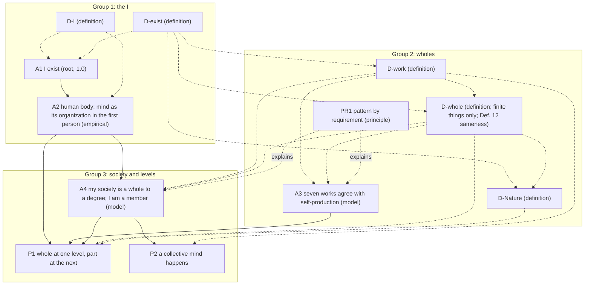

# Core v2 (candidate): the core rebuilt from "I exist"

**Status.** Candidate only. Nothing here is in `entries/`, nothing here has been scored, and nothing here changes `entries/`, `lens_test/`, `results/` or the verse drafts. Every confidence except A1's reads "pending (collider)". Built 2026-09-29 PT at the author's request: start over from the ground up, with A1 reduced to "I exist" and "human" moved into A2. Second round, the same evening: the author accepted A2, asked for a collision on Nature ([collision_nature.md](collision_nature.md)), and asked for definitions of "I" and "exist" so that A1 re-enters the chains (D-I, D-exist, D-Nature; section 3, second round). Third round, the same night: collisions on the sameness of the I ([collision_sameness.md](collision_sameness.md)) and on the page order ([collision_order.md](collision_order.md)), applied (section 3, third round).

## 1. The order

Twelve entries, plus four collisions. The page is in three groups, and each group opens with the definitions its claims use, as each of Parts One to Four of the *Ethics* sets out its own definitions at its head ([collision_order.md](collision_order.md)). A1 is the first claim and the third entry, straight after its two definitions, and A2 follows it. The definitions were worked out backward, from what the later claims needed a word to mean, and then placed before the claims that use them (HOW_THIS_BOOK_IS_BUILT.md, section 5).

**Group 1. The I.**

| # | Entry | Kind | Statement (one line) | Rests on |
|---|---|---|---|---|
| 1 | [D-I](D-I.md) | definition | "I", used in a thought, names the thinker of that thought, if there is a thinker distinct from the thinking, and otherwise the thinking itself. | (definition) |
| 2 | [D-exist](D-exist.md) | definition | An activity exists at a time when it is going on at that time; for anything else "exists" is taken as understood; a thing lasts when it goes on existing (duration, E2D5). Whether anything exists eternally is left open. | (definition) |
| 3 | [A1](A1.md) | root, 1.0 | I exist. (In defined terms: this thinking is going on now, and so its thinker, if it has one distinct from it, exists now.) | nothing: doubting it is a case of it; uses D-I, D-exist |
| 4 | [A2](A2.md) | axiom, empirical | I am a human body made of cells, and my mind is that same body's organization described in the first person. | A1 (its subject; caps nothing) and its own evidence (clause a, scored as: I am made of this body, and this thinking goes with it); identity with the body and clause b are a declared reading, unscored |

**Group 2. Wholes.**

| # | Entry | Kind | Statement (one line) | Rests on |
|---|---|---|---|---|
| 5 | [D-work](D-work.md) | definition | A work is an activity that helps keep a thing's organization going and is carried out by structures that organization produces or maintains; a thing performs it *as one* if the activity would stop were the thing's organization removed, its components kept going by other means; the seven works are boundary, control, energy, transport, signaling, defense, memory. | uses D-exist |
| 6 | [D-whole](D-whole.md) | definition | For finite things only (E1D2): grade each work 0, 1 or 2; a thing's degree of wholeness is its lowest grade; it is a whole if its degree is above zero; a member shares the whole's fate and takes part in its works; a thing produces itself if its own activities make and replace its components, those of its edge included (defined without the seven works); a whole is the same whole later if its organization lasted with no full stop and no branching, and its connectedness to its past is a degree. | uses D-exist, D-work (Definition 11 uses neither the works nor the grades) |
| 7 | [D-Nature](D-Nature.md) | definition | Nature taken as one is everything that exists, taken together (a plurality, not a set), with nothing besides it; it is not finite, so D-whole does not grade it; everything is in Nature, and being in Nature is not being a member. That it is really one substance, and Spinoza's God, is a declared reading, unscored. | uses D-exist, D-whole; result of [collision_nature.md](collision_nature.md) |
| 8 | [A3](A3.md) | axiom, model | The seven works sort things the way self-production does: what produces itself performs all seven as one; what lasts without producing itself fails at least one. | anchors, negative controls, hard cases |
| 9 | [PR1](PR1.md) | principle | Where the same requirement holds, the same work turns up, in forms that differ completely from level to level. | explains; adds no confidence |

**Group 3. Society and levels.**

| # | Entry | Kind | Statement (one line) | Rests on |
|---|---|---|---|---|
| 10 | [A4](A4.md) | axiom, model | The society I live in is a whole to a degree, judged one work at a time, and I am one of its members. | its own evidence, row by row; A2 for the membership clause |
| 11 | [P1](P1.md) | proposition | I am a whole at one level and a part at the next. | A2, A3, A4 |
| 12 | [P2](P2.md) | proposition | A collective mind, in the sense defined here, happens in the society I live in: control performed as one, combining signaling and memory; an activity, not a thing, and not a claim that the society feels. | A4 |

Definitions are numbered straight through, and the numbers rise down the page: D-I is Definition 1, D-exist 2, D-work 3–6, D-whole 7–12, D-Nature 13. Every cross-reference in core v2 was renumbered to match.

The collisions are not entries. Each is a written judgment between readings, and each produced changes to the entries.

- [collision_nature.md](collision_nature.md) produced D-Nature, D-whole's domain clause, and the new P1, Scholium 3.
- [collision_sameness.md](collision_sameness.md) produced D-whole, Definition 12, and the new P1, step 6.
- [collision_order.md](collision_order.md) produced this order.
- [collisions/core_v2_full_run.md](collisions/core_v2_full_run.md) ran every entry through the collider by hand, and produced the fourth round of changes (section 3).

## 2. Citation graph

Solid arrows carry support, and so caps. Dotted arrows show definitions used, or explanation. They carry no confidence. Boxes are the three page groups (section 1). The edges from D-I to the entries that say "I" beyond A1 and A2, and from D-exist to A3, PR1 and P2, are listed in each entry's `terms` and left out of the drawing to keep it readable.

**Caps (METHOD.md, rule 1).**

- A1 = 1.0.
- A2 = its clause (a) evidence. The cite of A1 caps nothing.
- A3 = its weakest anchor, control or hard-case result.
- A4 = its weakest row, and no more than A2, which its membership clause cites.
- P1 ≤ min(A2, A3, A4). Its "whole" half alone ≤ min(A2, A3).
- P2 ≤ the weakest of A4's control, signaling and memory rows, and, through A4's membership clause, no more than A2. A2 is not expected to bind.

Every chain of support now ends in the root or in evidence an axiom carries itself, as HOW_THIS_BOOK_IS_BUILT.md, section 3, says. Every chain that uses "I" passes through A2 to A1.

**Does A1 now do real work?** Yes. The work is logical, not evidential.

1. *A1 supplies the subject A2 describes.* A2 says what the I is made of and goes with, and, as a declared reading, what it is. Either needs an I that exists. A1 is the premise that there is one, and D-I says what the word names. Without A1, A2's "I" could fail to name anything.
2. *A1 does not supply sameness over time, and neither does D-I.* P1 needs the I that is a whole (A2) to be the I that is a member (A4). D-I names only the thinker of *this* thought (or the thinking itself), and A1 holds only "for as long as I am thinking". Where sameness belongs was collided ([collision_sameness.md](collision_sameness.md)). The verdict: sameness is defined once, for wholes (D-whole, Definition 12: the organization lasted, with no full stop and no branching; connectedness to the past is a separate degree). It reaches the I through what the I is found to be. A2 finds that this thinking goes with this body, P1, step 3, shows the body is a whole, and P1, step 6, applies Definition 12. Tracing this showed that A4's membership clause (my food, my public health, my work) is about that body, so **A4 cites A2**.
3. *A1 adds no confidence and removes none.* At 1.0 it caps nothing. What it adds is that the chains are valid: every "I" names something, and the chains end at the root as HOW says they do.

So A1 re-enters the chains through one solid edge, A1 → A2. Every chain that uses "I" reaches it: A4, P1 and P2 through A2. Chains that do not use "I" (A3's) end in evidence, as before.

## 3. What changed from the current entries, and why

| Current entry | In core v2 | Why |
|---|---|---|
| A1 "I, a human, exist." | **A1** "I exist." | The certainty (doubting it is a case of it) covers only that something is thinking now. "Human" is a fact about what I am, known on evidence, so it moves to A2. A side effect the author noted: A1 now fits any thinker, an AI included; the chains split at A2. |
| A2 "... that organization produces my mind." | **A2** "... my mind is that same body's organization described in the first person." | "Produces" posits a second thing caused by the first, which the evidence (the mind varies with the body) does not show. Following Spinoza (E2P7 Scholium, E2P13, E3P2 Scholium), mind and body are one thing described two ways. The evidence fits both readings, so clause (b) is declared, not scored. "First person / third person" replaces "inside / outside" everywhere. Why anything is felt stays undecided and is stated as A2's limit. |
| D-whole (filter + shared fate, no zero) | **D-work** + **D-whole** | The earlier D-whole had degrees but no zero, so it ruled nothing out. Now each of seven works is graded 0/1/2 and the degree is the lowest grade. Zero is the absence of a work, not a chosen cutoff, so the stone, the hurricane and the archive can come out as not wholes. "Filter" became the boundary work; "shared fate" became condition (a) of membership; "membership by function, not origin" is kept with its sources. *Work* is defined in the organizational sense (Mossio, Saborido & Moreno 2009), and *as one* is given a test (the take-apart test). |
| A3 "Society exhibits organism-level properties across seven rows." | split: **A3** (the measure works) and **A4** (society) | The old A3 did two jobs: testing the rows, and claiming them for society. Its failure test judged controls "by D-whole's own test", which was nearly circular. The new A3 tests the seven works against an independent standard, self-production (Maturana & Varela 1980), on anchors, negative controls and hard cases, with three stated ways to fail. Society gets its own entry. |
| PR1 "Pattern by requirement" | **PR1**, restated | Once a whole is *defined* by the seven works, "a whole must perform the seven works" is true by definition and empty. So the requirement thesis is now stated about self-producing things, with one requirement per work. Requirement (conditional) vs necessity (modal) is kept. It still adds no confidence. |
| A4 "I function within that society as a unit analogous to a cell." | **A4** (society, row by row, with me as a member) and **P1** | The sketch's A5 (society by degree) became A4, because the sketch's A4 ("a whole at one level and a part at the next") is derived and needs the society claim as a premise. So the sketch's A4 is now a proposition, P1, with a written demonstration. "Analogous to a cell" is dropped: P1 says *member*, which D-whole defines, and Scholium 2 says how a person is unlike a body cell. |
| P1 "a collective mind happens in society" | **P2** | The old argument ("cells produce a mind, persons are organized the same way, so a collective mind") would, under the new A2, carry the first-person clause across to the society and claim more than the evidence gives. P2 defines *collective mind* as control performed as one by a society (control, by definition, combines signaling and memory) and derives it from A4's rows. "Process, not a thing" now follows from the definition of a work as an activity, so the whirlpool image is no longer needed. Whether a society feels is left undecided, with Spencer and Spinoza on the two sides. |

### Second round (after the author's answers, 2026-09-29 PT)

| Where | Change | Why |
|---|---|---|
| A2 | Wording accepted as is. It now cites A1, and one bullet was added to clause (a): *this body* is the one the thinking goes with (closing these eyes ends my seeing). | The author accepted the wording. The cite and the bullet close the gap between A1's I and this body, which A2 had assumed without evidence. |
| **D-I** (new) | "I", used in a thought, names whatever is doing that thought: a thinker, or else the thinking itself. | So that A1 is built from defined terms. It allows Lichtenberg's point and is not defined through awareness, so it fits an AI and says nothing about feeling. |
| **D-exist** (new) | To exist at a time is to be going on, or present, at that time; to last is to go on existing. | So that A1's "exist" cannot be read in Spinoza's stronger senses (E1D1, E1D8). It also fixes "persistence", "last" and "exists as an activity exists", used in D-whole, A3, PR1 and P2. |
| A1 | `terms: [D-I, D-exist]`; restated in defined terms; noted as not true by definition. Now cited by A2. | A1 re-enters the chains, doing logical work rather than evidential work (section 2). |
| **D-Nature** (new) | Nature taken as one: everything that exists, conceived as one, with nothing besides it. It is not finite, so it is not graded. Being *in* Nature is not being a *member*. God is a declared reading. | The result of [collision_nature.md](collision_nature.md). |
| D-whole | Domain clause: finite things only (E1D2). Definitions renumbered 7–11. | Grading Nature 0 was a false zero. The tests assume something besides the graded thing. |
| A4 | Now cites A2 for its membership clause. | The I that depends on the society's food and public health is a body, so that clause rests on A2. This was found while tracing where A1's I goes. |
| P1 | New step 6 (the same I is the whole and the member); Scholium 3 rewritten (the levels stop short of Nature; the old "grade 0" withdrawn). | P1 needs one I in both halves, and A2 carries it. |
| P2 | Step 5 uses D-exist. The cap notes A2, through A4. | Follows from the A4 change. |
| All | Definitions renumbered straight through, 1–12. | D-I and D-exist come first. |

### Third round (two collisions, 2026-09-29 PT)

| Where | Change | Why |
|---|---|---|
| **collision_sameness.md** (new) | Collides "sameness built into D-I" (Locke, Descartes, S1–S5) with "carried by evidence about what the I is" (Butler, Reid, Hume, Parfit, Spinoza, B1–B6). | The author asked for it (open question 14). |
| D-whole | New **Definition 12 (the same whole)**. A whole is the same later if its organization went on, with no time at which it performed none of its works as one, and no other whole carrying that organization on as fully. Connectedness to its past is a separate degree. The domain clause now covers Definitions 7–12. | The verdict of the sameness collision. Sameness goes in no definition of a word, and it is not bare continuity of a living body. It is the sameness of an organization, defined once for wholes (after E2, Lemma 4), with Spinoza's poet (E4P39, Scholium) reported as the same whole, much less connected. |
| D-Nature | Renumbered Definition 13. | Follows from Definition 12. |
| D-I | "Sameness over time" now points to D-whole, Definition 12, and to the collision. | D-I stays thin. |
| A2 | The sentence "it is this one lasting body that does the thinking throughout" is replaced. A2 does not itself claim sameness over time. | "One lasting body" was too crude. P1 draws sameness from A2 and Definition 12. The statement is unchanged. |
| P1 | Step 6 now uses step 3 and D-whole, Definition 12. | The I of A2 is the I of A4 because this body is one whole that is the same across times. |
| **collision_order.md** (new) | Collides "all definitions first" (E) with "D-I, D-exist, A1, then the rest" (F). A third option (T) wins. | The author asked for it (open question 15). |
| README, section 1 and graph | The page is in three groups, each opening with its definitions: the I (D-I, D-exist, A1, A2); wholes (D-work, D-whole, D-Nature, A3, PR1); society and levels (A4, P1, P2). The graph shows the groups as boxes. | The verdict of the order collision. It follows the *Ethics* as a whole, where Parts One to Four each set out their own definitions at their head, rather than only Part One. |
| collision_nature.md | The "Order" bullet notes that it was superseded. | The order changed. |

### Fourth round (full hand run of the collider, 2026-09-30 PT)

Every entry was collided by hand ([collisions/core_v2_full_run.md](collisions/core_v2_full_run.md)). No entry broke outright. The old wordings are quoted in the run.

| Where | Change | Why |
|---|---|---|
| **collisions/core_v2_full_run.md** (new) | Twelve collisions, one per entry, with verdicts: D-I, D-work, D-whole, D-Nature and A4 hold with revision; A1 holds; D-exist, A2, A3, PR1, P1 and P2 split. | The author asked for a full run by hand. No numbers are given. |
| D-I | "names whatever is doing that thought" → "names the thinker of that thought, if there is a thinker distinct from the thinking, and otherwise the thinking itself". New Scholium 3 (Anscombe). | "Doing" covered an agent and an occurrence; the thinking does not do itself. The book's "I" is marked as a term of art. |
| D-exist | Defines existence for activities only; "or present" withdrawn; "exists" taken as understood for anything else; eternity (E1D8, E1P19) now left open in fact. Kant cited. | "Present" defined by a synonym, and the old time clause clashed with D-Nature's declared reading. Settles open question 16. |
| A1 | Gloss only: "this thinking is going on now, and so its thinker, if it has one distinct from it, exists now". | Follows D-I and D-exist. The axiom is unchanged. |
| A2 | Statement unchanged. Clause (a) is scored as *made of and goes with*; identity with the body joins the declared reading. "Made of cells" glossed as cells and what cells make. Baker, Olson, Alberts cited. | The evidence fits the constitution view and animalism alike. |
| D-work | Definition 3(b): "is carried out by structures that the thing's organization itself produces or maintains" (was "is itself kept going by that organization"). Definition 5 to match. The take-apart test is now a question about dependence. | The old (b) was looser than its source (Mossio's C2) and let a charging robot in. Most body cells die when dispersed, so the test cannot be a procedure. |
| D-whole | Definition 9: a member "while" both conditions hold; visitors and pets accepted as members while they meet them. | Membership comes and goes. |
| D-Nature | "conceived as one" → "taken together"; "as one" means counted as one; "really one" (E1P14) moves to the declared reading; no set of everything. | "One" covered a count and a claim. |
| A3 | New hard case: the self-recharging robot (Walter 1950), predicted degree 0. New paragraph on how far A3's two tests are apart. Today's AI systems are not wholes in the book's sense. | The robot breaks A3 on a loose reading of D-work's (b) and passes on the revised one. |
| PR1 | Thesis sorted into general requirements, requirements that hold in some circumstances, and memory as a state, not a stored record (Segré, Ben-Eli & Lancet 2000). | The seven were not of one strength, and "record" covered a nearly empty claim and a false one. |
| A4 | The society is all its institutions, state and non-state; the take-apart test disperses the institutions that carry each work. New scholium on state and society (Leeson 2007). | The state and the society can come apart. |
| P1 | Step 6 rests on A2's scored clause ("this thinking goes with this body"). New Scholium 4: which reading of "I am" is scored. | Follows A2. |
| P2 | Statement: "A collective mind, in the sense defined here, happens ..." New Scholium 4: three senses of "mind" (Stevenson 1938). | The name invited two claims the demonstration does not make. |
| README | Section 1 rows; section 2; design decision 6; open questions 6, 7, 16 updated, 18–22 added; self-check, fourth round. | Follows the entries. |

### Fifth round (dependency check fixes, 2026-10-01 PT)

The author approved all 25 fixes proposed in [audits/dependency_check.md](audits/dependency_check.md), with three judgment calls, and they are applied. The audit found one circle of meaning: "as one" (D-work) was defined by "whole" and "member", which D-whole defines by "as one". The recheck at the end of the audit confirms that the circle is gone, and lists what it found and fixed.

| Where | Change | Why |
|---|---|---|
| D-I, D-exist, D-Nature | "Thought", "thinker", "names", "activity" and "going on" are declared as understood; D-Nature says which sense of "exists" it uses for what is not an activity. | Primitives were used without being declared (Fixes 1, 2, 19). |
| A1 | "some thinking is going on" (was "something is doing the thinking"); "need name no more than that (D-I, second clause)"; the bridge from activity to agent is "taken as evident with the root". | Drift from D-I and D-exist (Fixes 3–5). |
| A2 | Glosses: "organization" is how the body's components are arranged and act on one another; "my mind" is this thinking together with the abilities it is done with (perceiving, remembering, speaking). Statement unchanged. | Both words were used before they were defined, or never defined (Fixes 6, 7; judgment call b). |
| D-work | Definition 5 and the take-apart test now speak of the *thing* and its *components*, not the whole and its members. "Organization" and "component" are glossed in Definition 3. `terms` gains D-exist. The test-question words are ordinary scientific words. The Scholium says that "produces or maintains" departs from Mossio's "and" so that a transplanted organ still counts. | This breaks the circle (Fixes 8–12; judgment call a). |
| D-whole | Definition 7 uses "components", not "members". Definition 9 says "lasting (D-exist)", glosses "depends", and keeps "part" for the member sense. Definition 11: "its own activities make and replace the components that carry out those activities, the components of its edge included". Definition 12: "has lasted". The D-Nature remark is marked as a forward note. | Breaks the inner loop, ends the two senses of "part", and removes drift (Fixes 13–18; judgment call c). |
| A3, PR1 | "produces itself (D-whole, Definition 11)"; PR1's condition is "if a thing that produces itself is to go on producing itself"; PR1's memory requirement is stated as D-work's memory work: stored information, used again in rebuilding. | Drift from Definition 11 and D-work (Fixes 20–22). |
| A4 | "Institution" defined. The energy row uses Definition 5's test; Spencer's point is said to bear on membership. Membership: "my lasting depends". | Fixes 23, 24. |
| P1 | Demonstration rewritten on A2's scored reading: steps 1–7 speak of "this body, the one this thinking goes with"; step 8 adds that on A2's declared reading the same holds of me. Statement unchanged. | The demonstration had used A2's unscored identity reading (Fix 25). |
| P2 | Step 2 matches the new Definition 6. | Follows Fix 18. |
| Verse draft v11 | Note 160 now matches core v2: the society claim is A4, and PR1's requirements are sorted, some holding only in some circumstances. Verse 149 is unchanged until core v2 is promoted. Logged in `drafts/verses/v11_changes.md`. | Audit section on the v11 notes. |
| README | Section 1 rows for D-work, D-whole and A3; section 2 graph (D-exist → D-work) and point 2; this table; self-check, fifth round. | Follows the entries. |

**Mapping from the agreed sketch.** Sketch A1 → A1. Sketch A2 → A2 (wording: "described in the first person" instead of "described from within", to keep "inside/within" out of the felt side). Sketch A3 → split into D-whole (the definition half: "a whole is whatever does the works of lasting as one, to the degree that it does") and A3 (the model half: the seven works pick out the right things). Sketch A4 → P1. Sketch A5 → A4.

## 4. Key design decisions

1. **A1 is deliberately thin, and now built from defined terms.** It says that I exist and nothing about what I am, for how long, or for whom beyond me (A1 scholia; Descartes, Lichtenberg). D-I and D-exist fix its two words at their thinnest, so A1 stays certain and still fits an AI.
2. **Evidence and reading are separated in A2.** Clause (a) is scored; clause (b) is declared and adds nothing.
3. **Definitions carry the tests, axioms carry the claims.** "What a whole is" is a definition; "the definition sorts real things right" is a claim that can fail (A3).
4. **An independent check against circularity.** The seven works are checked against self-production, which is defined without them. The anchors passing is expected and weak; the negative controls and hard cases (candle flame, virus, mature red blood cell, bacterial transport) carry the test.
5. **A true zero, and no cutoff above it.** The degree of wholeness is the lowest of seven coarse grades, reported with its profile. Degree of wholeness and confidence are kept as separate numbers.
6. **"As one" has a test.** Ask whether the activity at the whole's scale would stop if the whole's organization were removed while its members were kept going by other means; if it would, the whole was performing it. This is how "performed by the collective, not only by members separately" becomes checkable.
7. **"Performed" everywhere, "must" only in PR1.** No entry claims a requirement except PR1, and PR1 scores nothing.
8. **Collective mind by definition, not by analogy.** P2 names an activity and derives it; it claims nothing about feeling.
9. **Each entry does one job.** Twelve entries against the current seven. The old A3 did two jobs and is split into a test (A3) and a society claim (A4). "Work" needed its own definition. D-I and D-exist give A1 defined terms. D-Nature gives Nature an entry of its own. The seven works, grades, membership and levels live in definition entries rather than being spread across the axioms.
10. **Nature is outside D-whole, not at its bottom.** D-whole grades finite things only. Nature taken as one gets its own definition, and a relation of its own (*in*, not *member of*). This keeps D-whole's zero honest and keeps E1D7's line clear between the constrained things D-whole grades and the one free thing it does not (D-Nature, Scholium 4).
11. **A1's work is logical.** A1 supplies the subject that A2 describes. Sameness of the I across entries is not carried by A1 or D-I (section 2).
12. **Sameness is defined for wholes, not for the word "I".** D-whole, Definition 12, gives a yes-or-no test that can fail (a full stop, or branching) and a separate degree (connectedness). The I is the same over time because it is found to be a whole, not because of what "I" means ([collision_sameness.md](collision_sameness.md)).
13. **Each group opens with its definitions.** The page follows the *Ethics* as a whole, not only its Part One ([collision_order.md](collision_order.md)).

## 5. Open questions for the author

1. **Clause (b) of A2.** *Resolved:* the author accepted A2's wording as is.
2. **Self-production as the independent check.** Are you content to anchor A3 on Maturana and Varela's autopoiesis, and to count multicellular organisms as self-producing (which Maturana and Varela themselves left open)? The alternative is a different independent check, or none, in which case A3's failure test is circular again.
3. **The seven.** Miller has more subsystems (the reproducer, the timer and others). Keep the seven as a selection the book owns, or add any? Adding a row can only lower A4.
4. **Three grades.** Is 0/1/2 fine enough, or do you want finer grades once graders are shown to agree?
5. **The mature red blood cell.** The core predicts it is a member of the body but not a whole in its own right (memory 0). Are you comfortable with that consequence? It is the case most likely to split graders.
6. **Which society.** A4 is read as a population under one government with all its institutions, state and non-state (changed in the fourth round; see question 22). Should the book also claim anything for smaller societies, or for humanity as a whole?
7. **P2's name.** "Collective mind" now means only control performed as one, combining signaling and memory. Keep the name, given that it invites the stronger reading P2 disclaims? *Sharpened by the full run:* the statement now says "in the sense defined here", because the word has three senses (control; something felt; Spinoza's idea of a body) and a familiar word given a new meaning keeps the force of the old one (Stevenson 1938, "persuasive definitions"). A plainer name, such as "collective control", would remove the risk.
8. **Whether a society feels.** P2 leaves it undecided between Spencer (no corporate consciousness) and Spinoza (all individuals animated in different degrees). Is undecided your position, or do you want to lean?
9. **Promotion.** If accepted, these would replace the current seven entries in `entries/` and need rescoring by the collider; HOW_THIS_BOOK_IS_BUILT.md and METHOD.md name A1 as "I, a human, exist" and describe the old A3/A4/P1 chain, and would need matching edits. Nothing has been changed there.
10. **Kisner page numbers** for every Spinoza citation, pending your copy.
11. **A1 in the chains.** *Resolved by the second round:* A2 cites A1, and every chain that uses "I" reaches A1 through A2 (section 2). This needs a change to HOW's rule for empirical axioms (section 5a, item 1). Do you accept it?
12. **Nature.** *Resolved by [collision_nature.md](collision_nature.md):* Nature taken as one is not graded by D-whole, and has its own definition (D-Nature). Open: should Spinoza's stronger claims, that everything is in God in his sense of "in" (E1D5, E1P15) and that Nature is God as E1D6 defines God, stay a declared reading in D-Nature, or become an entry of their own? HOW has no kind for a claim that is neither self-evident nor scored on evidence.
13. **A4 cites A2.** Tracing A1's I showed that A4's membership clause is about a body, so A4 now cites A2. That formally caps A4, and through it P2, by A2. A2's clause (a) is expected to be high, so the cap should not bind. The alternative is to move the membership clause out of A4 into P1. Keep it in A4?
14. **Sameness of the I.** *Resolved by [collision_sameness.md](collision_sameness.md):* not in D-I; defined for wholes (D-whole, Definition 12) and reached through A2 and P1.
15. **The order.** *Resolved by [collision_order.md](collision_order.md):* three groups, each opening with its definitions.
16. **"Present" in D-exist.** *Resolved by [the full run](collisions/core_v2_full_run.md), section 2:* "present" defined existence by a synonym, and the time clause did not leave eternity open (E1D8, E1P19). D-exist now defines existence for activities only and takes it as understood for everything else.
17. **The poet: a departure from Spinoza.** Under D-whole, Definition 12, Spinoza's Spanish poet is the same whole, much less connected to his past. Spinoza says a body "undergoes death" when its proportion of motion and rest changes, even while the blood still circulates, and he would "hardly call him the same" (E4P39, Scholium). The book splits his test into a yes-or-no part and a degree. Do you accept that departure? The alternative is Spinoza's own test, whether the proportion changed, which he gives no threshold for.
18. **A2: "am" or "made of"?** The full run found that the evidence shows I am *made of* this body and that this thinking *goes with* it, but not that I am *identical* with it: the constitution view (Baker 2000) and animalism (Olson 1997) fit the same evidence. So identity is now part of the declared reading, unscored, and no longer part of clause (a). The statement is kept as you accepted it. Do you want it to say "made of" instead, or keep "I am a human body" and let the text say how it is scored?
19. **Robots and today's AI are not wholes.** D-work, condition (b), now asks that a work be carried out by structures the thing's own organization produces or maintains, as its source does (Mossio's C2). Read more loosely, a robot that docks to recharge would be a counterexample to A3. The cost: charging robots, and today's AI systems, whose hardware people make and maintain, perform none of the seven works as one and are not wholes in the book's sense. This says nothing about whether they think or feel. Are you content with that?
20. **Membership is cheap, and for a time.** By D-whole, Definition 9, a visitor, or a dog in a household, is a member while it meets both conditions. The full run accepts this. Do you?
21. **PR1 restructured.** The seven requirements are now of three strengths: general (energy, control, a sorting edge), holding only in some circumstances (transport, signaling, defense), and memory as a state that carries forward how parts are made, not a separate stored record (Segré, Ben-Eli & Lancet 2000). Do you accept the weaker, sorted thesis?
22. **Society, not state.** A4's society is now all its institutions, state and non-state, and its take-apart test disperses the institutions that carry each work. The reason is the case of Somalia after 1991 (Leeson 2007, whose reading is contested). Do you accept the wider reading, and the case?

## 5a. Implications for HOW_THIS_BOOK_IS_BUILT.md (not edited)

HOW describes the current `entries/`, so it has not been changed. If core v2 is promoted, these edits would be needed:

1. **Section 2, empirical axiom.** "It cites no other entry" becomes "It cites no other entry except the root, for its subject. The root caps nothing, so the evidence written into the axiom still carries its whole score."
2. **Section 2, root.** "A1, 'I, a human, exist.'" becomes "A1, 'I exist,' stated in two defined terms (D-I, D-exist). The definitions say what the words mean. The doubt shows that something answers to them."
3. **Section 2, definition.** Add D-Nature as an example of a definition that marks the edge of another definition's domain: D-whole grades finite things only, and Nature is not finite.
4. **Section 3.** "Each chain ends in one of two places: the root (A1), or evidence the entry carries itself" is true again. Add: "Every chain that uses 'I' reaches the root through A2."
5. **Section 5 (order).** "On the page, definitions come first, as in Spinoza" becomes "On the page, definitions come first in each group, as in each Part of Spinoza's *Ethics*." A1 is the first claim, straight after its two definitions.
6. **A kind for declared readings.** A2's clause (b) and D-Nature's identification with God are both *declared readings*: stated, not derived, and not scored. HOW could name this as a kind, with its limit: a declared reading adds no confidence to anything.
7. **How to read "whole" and "part".** A reader should be told that the book's "whole" is narrower than Spinoza's. For Spinoza, Nature is the whole most of all (Letter 32). For the book, a whole is a finite thing that lasts by its works. "In Nature" and "member of" are different relations.
8. **How to read "the same I".** A reader should be told that "I" names the thinker of one thought, or the thinking itself (D-I), and that sameness over time is a finding about a whole (D-whole, Definition 12), not part of the word. So the book can say that I am the same, and how far I am connected to my past, as two different things. It does not claim that sameness is what matters.

## 6. Strict nonsense self-check

Run over all nine entries and this README after the first full draft, for: empty profundity, internal contradiction, overclaiming, muddled metaphor, factual slips, "must perform" vs "performed", "inside" used for place and for the felt side, and aiming (teleological) language. Every quotation was re-checked: Spinoza against `sources/spinoza/ethics_elwes_1883.txt`; Descartes against the Cottingham and Oxford translations (AT VII 25, 27); Lichtenberg against the German text of K 76; Spencer against the Econlib text; Mossio, Saborido & Moreno's conditions against the published wording; Maturana & Varela's definition against two independent reproductions.

### Caught and fixed

| # | Where | Problem (category) | Fix |
|---|---|---|---|
| 1 | A1, "Why it is certain" | Said "a thought going on now is enough for a thinker now", then quoted Lichtenberg, whose point is exactly that thought does not give a thinker. (contradiction) | Now: doubting is going on, so *something* exists, at the least the doubting; "I" names no more than that. |
| 2 | A1, confidence | "whose denial would be an instance of it" (the denial is an instance of thinking, not of the claim). (muddle) | "whose denial, made by me, proves it". |
| 3 | A1, "for whom" | "Not evidence to a reader that I exist" (reading the book *is* evidence the author existed). (factual slip) | "A reader has only evidence that I exist, not certainty." |
| 4 | A2 | Cited A1 as a support, against HOW's rule that an empirical axiom cites no entry, while A1's own text says it lends no evidence. (inconsistency) | `cites: []`; the "I" is marked as A1's subject; graph edge made dotted; open question 11. |
| 5 | A2, lesion evidence | "Damage to a specific structure takes away a specific ability": causal wording from body to mind, which clause (b) and E3P2 deny. (contradiction) | "Where a structure is damaged, an ability is gone", plus: read by clause (b), one event described twice. |
| 6 | A2, reading | "Every mental ability varies with the organization", from two lesion cases. (overclaim) | "its mental abilities vary with ..."; the two cases are called two classic cases of one pattern. |
| 7 | A2, Spinoza | "E2P7, *because* [Scholium]" and "E3P2, *since* [Scholium]": the scholia are not the proofs of those propositions. (factual slip) | "and in the Scholium, ...". |
| 8 | A2, choice of reading | "Two descriptions ... posit nothing further" (they posit an identity). (overclaim) | "posit no second thing. This is a reason of economy, not evidence." |
| 9 | A2, limit | "names *where* the felt side is found": place language for the felt side. (inside/place slip) | "says which description feeling belongs to". |
| 10 | A2, AI scholium | "A2 is where the author's chain becomes the author's." (empty profundity) | "A2 is the first entry whose evidence is about one particular kind of thing." |
| 11 | A2, H.M. | "both medial temporal lobes were removed" (tissue was removed from the medial temporal lobe on each side, not whole lobes). (factual slip) | Reworded. |
| 12 | D-whole, Def. 9 | "a whole in its own right (most of my cells)": by count most of the body's own cells are red blood cells, which D-whole itself says are not wholes. (factual slip, contradiction) | "a nucleated cell of mine", with the count stated. |
| 13 | D-whole, Def. 10 | Said the society is "at the next level after" me "with groups and organizations between", while defining "next level" by direct membership, which I have. (contradiction) | Levels made explicitly relative: society and my groups are both at the next level up from me; P1, Scholium 1, matched. |
| 14 | D-whole, Scholium 2 | Said the old D-whole made "every lasting thing a whole to some degree" (it said only that wholeness had no zero). (overclaim about the old text) | "gave no zero, so the definition ruled nothing out." |
| 15 | D-work, Scholium | "C3 is met by anything that performs all seven works": asserted, not shown. (overclaim) | "roughly what performing seven distinct works amounts to; not tested separately." |
| 16 | D-work, Def. 3 | "The heart's pumping is the standard example." (unsourced) | Attributed as Mossio and colleagues' own example. |
| 17 | A3 / PR1 | Self-production was defined inside an axiom (A3) and borrowed by PR1: a definition hiding in a claim. (form) | Moved to D-whole, Definition 11, still defined without the seven works. |
| 18 | A3, anchors | Counted multicellular organisms as self-producing without noting that Maturana and Varela left this open. (overclaim) | "A caution on the anchors", with the 1987 source; open question 2. |
| 19 | A3 | Hard cases tested only the too-loose direction (F2). (one-sided test) | Added bacterial transport by diffusion as the too-strict case (F1). |
| 20 | PR1 | "a whole must perform the seven works": true by definition once D-whole is defined by the seven works. (empty) | Thesis restated about self-producing things; the memory requirement made concrete ("keep a record of how its parts are made") instead of the near-tautology "to use the past it must store it". |
| 21 | PR1, "what would count against it" | "a whole that loses one and goes on lasting as one": by D-whole such a thing is no longer a whole, so the case cannot occur. (contradiction) | "a self-producing thing that loses a work and goes on producing itself". |
| 22 | A4, boundary | "Dissolve the state and no one sorts what crosses" (neighbouring states still do). (overclaim) | "no one sorts what crosses on the society's behalf". |
| 23 | A4, signaling | "the channels ... go dark". (metaphor) | "stop". |
| 24 | P1, cap | "its first half is stronger than its second": the cap rule gives only "no weaker". (overclaim) | "can be no weaker than". |
| 25 | P1, Scholium 3 | "D-whole cannot grade nature": it can, and the grade is 0. (muddle) | Nature gets 0 on boundary and energy, so it is not a whole in the book's sense; flagged as open question 12. |
| 26 | P2, statement vs. step 4 | Statement said "to the degree that it performs control"; step 4 set the degree by the lowest of three rows, and argued it by an unsupported claim that control "cannot be performed further than" its inputs. (inconsistency, overclaim) | Statement now names control with the signaling and memory it uses; step 4 uses the lowest-grade rule of D-whole, Definition 8. |
| 27 | P2, Scholium 2 | "On Spinoza's view a society's organization would also have its idea": assumes a society is a Spinozan individual. (overclaim) | "on his terms, if a society is an individual, there is an idea of it too." |
| 28 | P2, Scholium 3 | "argues from the control row alone" (it uses three rows). (inconsistency) | Corrected. |
| 29 | P2 / README | "control takes up the other two" (vague). (muddle) | "combines". |
| 30 | README, design decision 9 | Claimed "fewer entries": core v2 has nine, the current set seven. (factual slip) | Says nine against seven, and why the two were added. |
| 31 | README | "separated inside A2", "thin on purpose". (inside/aim wording) | "separated in A2", "deliberately thin". |

**Sweeps with no remaining hits.** "must" appears only in PR1 (and in README text quoting it). "inside" is not used in any entry except where A2 says the book does not use it. No entry uses "aim", "purpose", "goal", "in order to", "so that" or "needs" of a whole or a work; D-work states that "contributes" is causal and implies no aim. The whirlpool image is gone. "Produces" is used of self-production and of the reading A2 declines, never of mind.

### Left open (not fixed, stated so the author can decide)

- **The stone's "conflict dimension".** The old open item dissolves: conflict is now one reason a grade is held at 1, and the stone gets 0 on boundary and energy before conflict arises. Confirm.
- **F3 has no number.** "Graders often disagree about whether a grade is zero" should become a stated agreement rate once the collider exists.
- **Maturana & Varela page.** The definition is quoted as on pp. 78–79 of the 1980 volume; reproductions differ between p. 79 and pp. 78–79. Check against a copy.
- **Miller.** The subsystem grouping follows the sourced A3 isomorphism table; Miller's book itself was not re-read for this draft.
- **Expected grades are guesses.** A4's "several rows will likely be graded 1" and A3's predicted zeros are predictions, not results. Nothing here is scored.
- **Kisner pages** for every Spinoza citation, pending the author's copy.

### Second round (collision, D-I, D-exist, D-Nature, and the edits they caused)

Run over collision_nature.md, D-I, D-exist, D-Nature, and every changed passage of A1, A2, A4, P1, P2, D-whole and this README, in the same categories and sweeps as the first round. New quotations were re-checked. Spinoza's *Ethics* was checked against `sources/spinoza/ethics_elwes_1883.txt`, with the Latin checked in `ethica_latin.txt`: E1P12, E1P13, E1P15 Scholium (*modaliter tantum distinguuntur, non autem realiter*), E2 Lemma 7 Scholium (*totam naturam unum esse Individuum*), E4 Preface (*Deum seu Naturam*), E4P4 (*Fieri non potest ut homo non sit Naturae pars*) and its Demonstration (*Dei seu Naturae*). Letter 32 was checked in Elwes's text of the letters, and its date and Latin against the Huygens *Oeuvres complètes*, vol. V, no. 1498. Letter 64's Latin and its date were checked against Camerini & Di Corato (2026). Descartes was checked against the CSM wording: AT VII 28–29, AT VII 160 (CSM II 113), and *Principles* I.9, AT VIIIA 7.

| # | Where | Problem (category) | Fix |
|---|---|---|---|
| 32 | collision, W1 | "Besides God nothing can be granted (E1P14)": E1P14 says no *substance*. (factual slip) | "no substance can be granted or conceived (E1P14), whatever is, is in God (E1P15)". |
| 33 | collision, J5 and W5 | "Its title begins with God": the title begins with *Freedom*; God begins the subtitle. (factual slip) | "subtitle". |
| 34 | collision, N6 | Cited E1P21 (immediate infinite modes) for the face of the whole universe, which Letter 64 gives as a *mediate* one. (factual slip) | E1P22, quoted. |
| 35 | collision, W4 | "*natura naturans* produces all its modes (E1P29, Scholium)": the Scholium distinguishes the two; it does not state the production. (overclaim) | "Everything that follows from the necessity of God's nature ... follows from Nature viewed as active". |
| 36 | collision, N2 | "0 by default, or 2 by courtesy". (muddled metaphor) | "0 because the test cannot be put, or 2 by stipulation". |
| 37 | collision, verdict | "The levels stop at the largest whole that has members": assumes there is a largest. (overclaim) | "levels among finite things, and none of them is Nature". |
| 38 | collision, D-Nature | "The distinction the book's title turns on." (overclaim about the book) | "E1D7's pair, *free* and *necessary*, is the pair in the book's title." |
| 39 | collision | "must" three times in the author's voice. (must rule) | Rephrased; "must" now appears only inside quotations of Spinoza. |
| 40 | collision, table | "the book's [whole] needs something else to act against". ("needs" of a whole) | "applies only where other things act". |
| 41 | collision, table | Freedom row: "W is silent". A steel man should get its best reply. (one-sided) | W's best reply added (on Letter 32's concept, whole and free come close); it turns out to confirm the distinction. |
| 42 | collision, verdict | "Nature ... does not grade at all" (Nature is not the one grading). (muddle) | "Nature is not graded at all." |
| 43 | D-Nature, first draft | "Finite" was defined in D-Nature, which was placed before D-whole but numbered after it. (inconsistency) | "Finite" moved into D-whole's domain clause; D-Nature placed after D-whole; definitions renumbered 1–12 across core v2. |
| 44 | D-Nature | "stronger than Definition 10's", left over from the renumbering. (slip) | "Definition 12's". |
| 45 | D-Nature, Scholium 1 | "For Spinoza a thing is a whole in so far as no external cause acts on it": a general doctrine drawn from one letter. (overclaim) | "In Letter 32, a thing is considered a whole ...". |
| 46 | D-Nature, Scholium 1 | "finite things that last by their own works, among other things" (ambiguous). (muddle) | "a finite thing that lasts by its own works while other things act on it". |
| 47 | D-I | Took Descartes's list of thinking but dropped his awareness clause without saying what that leaves open. (hidden gap) | Scholium 2: whether doubting without awareness is still doubting is left open, and that is the AI question. |
| 48 | D-exist | For things that are not activities, "present" is nearly a synonym of "exist". (risk of empty definition) | Admitted in the text; open question 16. |
| 49 | collision, references | Letter 64's English was first attributed to Curley's translation without checking it, and the secondary source to "Jolma" (the journal's name, not an author). (citation slip) | Translated from the Latin; the source is Camerini & Di Corato (2026), *JoLMA* 7(1), with its DOI. |
| 50 | README, section 2 (first plan) | Planned to say that A1 carries the same I into both halves of P1. D-I names only the thinker of *this* thought (or the thinking itself), and A1 holds "for as long as I am thinking". (overclaim) | Sameness is carried by A2, on evidence. A4 cites A2; P1, step 6, states the identity; open question 14. |
| 51 | A2 | Identified A1's I with "this body" without first-person evidence that ties the two. (gap) | One bullet added to clause (a): the thinking goes with this body (closing these eyes ends my seeing). The statement is unchanged. |
| 52 | D-whole, references | Spinoza inserted out of alphabetical order. (form) | Moved. |

**Earlier fixes now superseded.** Fix 4 (A2 `cites: []`, dotted A1 edge) is reversed: A2 cites A1, with the HOW change proposed in section 5a. Fix 25 ("Nature gets 0") is withdrawn: Nature is not graded (collision_nature.md).

**Sweeps with no remaining hits.** "must" appears only in PR1 and inside quotations of Spinoza. "Inside" is not used in any new text. "Outside" is used only of place ("something outside X", "outside its domain"), never of the felt side. No new text uses "aim", "purpose", "goal" or "in order to" of a whole or a work. The only such words are Spinoza's "nature has no particular goal in view", quoted to reject aims, and "needs" used of a book or of an argument. No new citation was left unverified. Kisner pages are still pending.

### Third round (collision_sameness, collision_order, and the edits they caused)

Run over both new collisions, D-whole, Definition 12, and the changed passages of D-I, A2, P1, D-Nature, collision_nature.md and this README, in the same categories and sweeps. New quotations were re-checked. Spinoza was checked against `sources/spinoza/ethics_elwes_1883.txt`, with the Latin checked in `ethica_latin.txt`: the Definition after E2, Lemma 3; Lemmas 4–7 (*absque ulla ejus formae mutatione*); E4P39 and its Scholium (*ut non facile eundem illum esse dixerim*; *de quodam hispano poeta*); and the placement of definitions, axioms and postulates in Parts One to Five. The other sources were checked as follows:

- Locke, II.xxvii.9 and 26: the SEP entry on Locke on personal identity, and a full-text reproduction.
- Butler: two full-text reproductions of the 1736 dissertation, and the SEP.
- Reid: the chapter title and the brave officer, from reproductions of Essay III, ch. 6.
- Hume, T 1.4.6.4 and the Appendix: davidhume.org and a second reproduction.
- Parfit: Relation R, and the non-branching condition, from three secondary sources that agree on pp. 215–217.
- Descartes: AT VII 14 (CSM II 10) and AT VII 28–29 (CSM II 19), from the CSM wording.

| # | Where | Problem (category) | Fix |
|---|---|---|---|
| 53 | collision_sameness, S1 | Quoted Locke as "Person ... is a forensic term": the text reads "It is a forensic term". (misquote) | "'person' is 'a forensic term, ...'". |
| 54 | collision_sameness, B2 | Reid's case summarized as "the general has forgotten the boy". In Reid, the general has forgotten the flogging, and remembers taking a standard as an officer. (factual slip) | Restated as in Reid. |
| 55 | collision_sameness, S2 | "the phrase A2 and P1 now use", though this round removes it. (inconsistency) | "used after the second round". |
| 56 | collision_sameness, verdict | "one lasting body ... gave the wrong answer in Spinoza's own case". The new Definition 12 gives the same yes-or-no answer for the poet. (inconsistency) | What falls is that "one lasting body" did not say what makes a body the same, and registered nothing of the poet's loss. The table now says the yes-or-no answer is unchanged and the loss shows as a degree. |
| 57 | collision_sameness, Descartes row | Said Descartes's Synopsis claim "does not fit a body that replaces its red blood cells". The Synopsis speaks of a change of shape, not of replacement. (muddle) | "is what E2, Lemmas 4–7, deny: an individual survives the replacement, growth and change of direction of its parts". |
| 58 | collision_sameness, J6 | Called "connectedness" and "went on" causal words. (factual slip about words) | "describe; they do not name an aim". |
| 59 | D-whole, Definition 12 | "A loss of memory ... does not make it a different whole" said without limit. But if the memory work stops altogether, the degree is 0 and the thing is not a whole (Definition 8). (contradiction) | Added: if a work stops altogether, the thing is no longer a whole, and the question of its sameness as a whole lapses. |
| 60 | D-whole, Definition 12, first draft | "It also covers a copy of an AI that runs alongside the original" implied that the original stays the same. Under the non-branching clause, a copy that carries the organization on as fully means *neither* is the same. (overclaim) | Stated: then neither is the same whole, as in Parfit's cases of division. The same correction was made in the collision's AI row. |
| 61 | collision_order, F3 | "Each of Parts One to Four opens with its own definitions": Parts Three and Four open with a preface. (factual slip) | "sets out its own definitions at its head, after a preface in Parts Three and Four". |
| 62 | collision_order, K6 | "E suggests the root rests on biology". (overclaim) | "can suggest". |

**Sweeps with no remaining hits.** "must" appears only in PR1 and inside quotations (Spinoza, Hume). "Inside" is not used in new text. "Within" is used only of a stretch of thinking or of a page group, and "outside" only of a definition's domain. No aiming words are used of a whole or a work. Check K1 of collision_order passes for the new order: no entry uses a term or cites an entry below it (scanned from the `terms` and `cites` fields). Kisner pages are still pending. Parfit's pages rest on secondary sources that agree with one another, and should be checked against a copy.

### Fourth round (the full run, and the edits it caused)

Run over [collisions/core_v2_full_run.md](collisions/core_v2_full_run.md) and every changed passage of the twelve entries and this README, in the same categories and sweeps. New Spinoza quotations were checked against `sources/spinoza/ethics_elwes_1883.txt`: E1D8 and its Explanation, E1P14, E1P19. Each new outside source was checked on the web: Anscombe 1975 (the sentence on p. 60), Kant A598/B626 (Kemp Smith), Baker 2000, Olson 1997, Segré, Ben-Eli & Lancet 2000, Walter 1950 (the tortoises were built to recharge at a hutch; that a full recharging cycle was ever completed is not on record, so the text says "built to"), Stevenson 1938, Leeson 2007, and Alberts et al. 2015, which A3 already cites.

| # | Where | Problem (category) | Fix |
|---|---|---|---|
| 63 | run, A1, shared floor | "The objector has to doubt, or think, in order to object." (aim wording) | "No one can object without doubting or thinking." |
| 64 | run, verdicts | "Two readings broke inside entries that survive." (inside wording) | "in entries". |
| 65 | A4 and run, Leeson | The first draft said Somalia "did no worse, and often better", which understates his finding, and dropped his caveat that it stayed poor. It also gave his description of trade and law as plain fact. (factual slip) | "On Leeson's account ... did better on most of eighteen development indicators ..., though it stayed poor"; the README question notes that his reading is contested. |
| 66 | A2, references | Inserting Olson garbled the Scoville & Milner entry and broke the alphabetical order. (form) | Repaired. |
| 67 | D-I, Scholium 3, first draft | "If 'I' names nothing, what the doubt shows is ... D-I's second clause": if the word names nothing, no clause of D-I names anything. (muddle) | "If ordinary 'I' names nothing, ... the book's 'I' names that thinking by D-I's second clause." |
| 68 | D-I, "Lichtenberg allowed" | It quoted the withdrawn wording, "Or else the thinking itself". (inconsistency) | "Otherwise the thinking itself". |
| 69 | D-I, "Sameness over time"; README, section 2 | "A2 identifies the doer with this body", after identity left A2's scored clause. (inconsistency) | "A2 finds that this thinking goes with this body". |
| 70 | README, section 2, point 1; design decision 11 | "A2 says what the I is. That is an identity claim." (inconsistency) | "A2 says what the I is made of and goes with, and, as a declared reading, what it is." |
| 71 | README, question 18, first draft | "Identity is now scored as part of the declared reading": what is declared is not scored. (contradiction) | "part of the declared reading, unscored". |
| 72 | run, verdict table | '"or present" defined by a synonym' leaves out what was defined. (muddle) | "defined existence by a synonym". |
| 73 | A3, robot hard case, first draft | It listed six of the robot's activities and then said it "might pass all seven". (overclaim) | The casing that admits charge and keeps out dust and water is named as its candidate edge. |
| 74 | run, A2, the transplant case | A citation for the transplant case was considered but not verified this round. (unverified citation) | The case is argued without a citation. Baker and Olson, which were verified, carry the two views. |

**Sweeps with no remaining hits.** "must" appears only in PR1 and inside quotations, including the run's quotations of PR1. "Inside" is not used of the felt side, and "outside" is used only of place or of a domain. No aiming words are used of a whole or a work; "aims" appears only where a definition is said to need none. Check K1 of collision_order passes: no entry uses a term or cites an entry below it (scanned from the `terms` and `cites` fields, which this round did not change). All frontmatter parses. No numeric scores were added anywhere. Kisner pages are still pending.

### Fifth round (the dependency check fixes, and the recheck)

Run over every passage changed by Fixes 1–25, note 160, and this README, in the same categories and sweeps. No new source was cited, so no new citation needed checking; Mossio's C2 ("produced and maintained") was checked against the quotation already in D-work.

| # | Where | Problem (category) | Fix |
|---|---|---|---|
| 75 | D-whole, Definition 7, grades 1 and 2 | Still "for some of its members" and "across the whole", so the inner loop of meaning was open after Fix 13. (incomplete fix) | "components"; "across all of X". |
| 76 | D-work, Definition 3; D-whole, Definition 9 | "Component" carried the plain sense everywhere but was never said to. (undeclared) | Glossed in Definition 3; Definition 9 points to it. |
| 77 | A2, Two descriptions | The new gloss pointed to D-work's Scholium, after the gloss moved to Definition 3. (factual slip) | "D-work, Definition 3". |
| 78 | P1, step 6 | "its works have gone on" after Definition 12 became "has lasted". (drift) | "its organization has lasted". |
| 79 | P2, step 2 | "its components" had no antecedent; "each member" did not match Definition 5. (muddle) | "a thing's components"; "each person". |
| 80 | A4, energy row, first draft | "for the society as a whole" used the word A4 sets out to establish. (circular wording) | "at the society's own scale". |
| 81 | A2, PR1, D-exist, README | Plain "part" left over after Fix 18. (equivocation) | "clause", "belongs to", "component", "produces itself". |

**Sweeps with no remaining hits.** "must" appears only in PR1 and in quotations. "Inside" is not used of the felt side; "outside" is used only of place ("something outside the thing") or of a domain. No aiming words were added. Plain "parts" remains only in quotations and reports of other authors, as Definition 9 allows. Check K1 passes, including D-work's new `terms` entry. All frontmatter parses. No numeric scores were added. Kisner pages are still pending.

