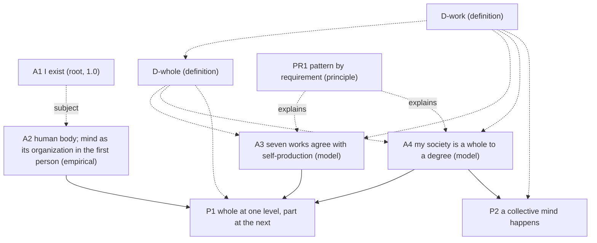

# Core v2 (candidate): the core rebuilt from "I exist"

**Status.** Candidate only. Nothing here is in `entries/`, nothing here has been scored, and nothing here changes `entries/`, `lens_test/`, `results/` or the verse drafts. Every confidence except A1's reads "pending (collider)". Built 2026-09-29 PT at the author's request: start over from the ground up, with A1 reduced to "I exist" and "human" moved into A2.

## 1. The order

Nine entries. A1 comes first on the page and first in the reasoning, the only entry that does both. The definitions come next. They were worked out backward, from what the later claims needed a word to mean, and then placed before the claims that use them (HOW_THIS_BOOK_IS_BUILT.md, section 5). A1 uses no defined word, so it can stand ahead of them.

| # | Entry | Kind | Statement (one line) | Rests on |
|---|---|---|---|---|
| 1 | [A1](A1.md) | root, 1.0 | I exist. | nothing: doubting it is a case of it |
| 2 | [D-work](D-work.md) | definition | A work is an activity that helps keep a thing's organization going and is kept going by it; a thing performs it *as one* if taking the thing apart, members left alive, would stop it; the seven works are boundary, control, energy, transport, signaling, defense, memory. | (definition) |
| 3 | [D-whole](D-whole.md) | definition | Grade each work 0, 1 or 2; a thing's degree of wholeness is its lowest grade; it is a whole if its degree is above zero; a member shares the whole's fate and takes part in its works; a thing produces itself if its own processes make and replace its components (defined without the seven works). | uses D-work (Definition 9 does not) |
| 4 | [A2](A2.md) | axiom, empirical | I am a human body made of cells, and my mind is that same body's organization described in the first person. | its own evidence (clause a); clause b is a declared reading, unscored; its "I" is A1's subject |
| 5 | [A3](A3.md) | axiom, model | The seven works sort things the way self-production does: what produces its own parts performs all seven as one; what lasts without producing its own parts fails at least one. | anchors, negative controls, hard cases |
| 6 | [PR1](PR1.md) | principle | Where the same requirement holds, the same work turns up, in forms that differ completely from level to level. | explains; adds no confidence |
| 7 | [A4](A4.md) | axiom, model | The society I live in is a whole to a degree, judged one work at a time, and I am one of its members. | its own evidence, row by row |
| 8 | [P1](P1.md) | proposition | I am a whole at one level and a part at the next. | A2, A3, A4 |
| 9 | [P2](P2.md) | proposition | A collective mind happens in the society I live in: control performed as one, combining signaling and memory; an activity, not a thing, and not a claim that the society feels. | A4 |

## 2. Citation graph

Solid arrows carry support (and so caps). Dotted arrows are definitions used, explanation, or (A1 to A2) the subject that A1 secures; they carry no confidence. A1 lends no evidence, so it is not cited as a support: an empirical axiom cites no other entry (HOW_THIS_BOOK_IS_BUILT.md, section 2).

**Caps (METHOD.md, rule 1).** A1 = 1.0. A2 = its clause (a) evidence. A3 = its weakest anchor, control or hard-case result. A4 = its weakest row. P1 ≤ min(A2, A3, A4); its "whole" half alone ≤ min(A2, A3). P2 ≤ the weakest of A4's control, signaling and memory rows. Every chain of support ends at evidence an axiom carries itself; every "I" in it refers back to A1.

## 3. What changed from the current entries, and why

| Current entry | In core v2 | Why |
|---|---|---|
| A1 "I, a human, exist." | **A1** "I exist." | The certainty (doubting it is a case of it) covers only that something is thinking now. "Human" is a fact about what I am, known on evidence, so it moves to A2. A side effect the author noted: A1 now fits any thinker, an AI included; the chains split at A2. |
| A2 "... that organization produces my mind." | **A2** "... my mind is that same body's organization described in the first person." | "Produces" posits a second thing caused by the first, which the evidence (the mind varies with the body) does not show. Following Spinoza (E2P7 Scholium, E2P13, E3P2 Scholium), mind and body are one thing described two ways. The evidence fits both readings, so clause (b) is declared, not scored. "First person / third person" replaces "inside / outside" everywhere. Why anything is felt stays undecided and is stated as A2's limit. |
| D-whole (filter + shared fate, no zero) | **D-work** + **D-whole** | The earlier D-whole had degrees but no zero, so it ruled nothing out. Now each of seven works is graded 0/1/2 and the degree is the lowest grade. Zero is the absence of a work, not a chosen cutoff, so the stone, the hurricane and the archive can come out as not wholes. "Filter" became the boundary work; "shared fate" became condition (a) of membership; "membership by function, not origin" is kept with its sources. *Work* is defined in the organizational sense (Mossio, Saborido & Moreno 2009), and *as one* is given a test (the take-apart test). |
| A3 "Society exhibits organism-level properties across seven rows." | split: **A3** (the measure works) and **A4** (society) | The old A3 did two jobs: testing the rows, and claiming them for society. Its failure test judged controls "by D-whole's own test", which was nearly circular. The new A3 tests the seven works against an independent standard, self-production (Maturana & Varela 1980), on anchors, negative controls and hard cases, with three stated ways to fail. Society gets its own entry. |
| PR1 "Pattern by requirement" | **PR1**, restated | Once a whole is *defined* by the seven works, "a whole must perform the seven works" is true by definition and empty. So the requirement thesis is now stated about self-producing things, with one requirement per work. Requirement (conditional) vs necessity (modal) is kept. It still adds no confidence. |
| A4 "I function within that society as a unit analogous to a cell." | **A4** (society, row by row, with me as a member) and **P1** | The sketch's A5 (society by degree) became A4, because the sketch's A4 ("a whole at one level and a part at the next") is derived and needs the society claim as a premise. So the sketch's A4 is now a proposition, P1, with a written demonstration. "Analogous to a cell" is dropped: P1 says *member*, which D-whole defines, and Scholium 2 says how a person is unlike a body cell. |
| P1 "a collective mind happens in society" | **P2** | The old argument ("cells produce a mind, persons are organized the same way, so a collective mind") would, under the new A2, carry the first-person clause across to the society and claim more than the evidence gives. P2 defines *collective mind* as control performed as one by a society (control, by definition, combines signaling and memory) and derives it from A4's rows. "Process, not a thing" now follows from the definition of a work as an activity, so the whirlpool image is no longer needed. Whether a society feels is left undecided, with Spencer and Spinoza on the two sides. |

**Mapping from the agreed sketch.** Sketch A1 → A1. Sketch A2 → A2 (wording: "described in the first person" instead of "described from within", to keep "inside/within" out of the felt side). Sketch A3 → split into D-whole (the definition half: "a whole is whatever does the works of lasting as one, to the degree that it does") and A3 (the model half: the seven works pick out the right things). Sketch A4 → P1. Sketch A5 → A4.

## 4. Key design decisions

1. **A1 is deliberately thin.** It says that I exist and nothing about what I am, for how long, or for whom beyond me (A1 scholia; Descartes, Lichtenberg).
2. **Evidence and reading are separated in A2.** Clause (a) is scored; clause (b) is declared and adds nothing.
3. **Definitions carry the tests, axioms carry the claims.** "What a whole is" is a definition; "the definition sorts real things right" is a claim that can fail (A3).
4. **An independent check against circularity.** The seven works are checked against self-production, which is defined without them. The anchors passing is expected and weak; the negative controls and hard cases (candle flame, virus, mature red blood cell, bacterial transport) carry the test.
5. **A true zero, and no cutoff above it.** The degree of wholeness is the lowest of seven coarse grades, reported with its profile. Degree of wholeness and confidence are kept as separate numbers.
6. **"As one" has an operational test.** Take the whole apart, leaving its members alive; if the activity at the whole's scale stops, the whole was performing it. This is how "performed by the collective, not only by members separately" becomes checkable.
7. **"Performed" everywhere, "must" only in PR1.** No entry claims a requirement except PR1, and PR1 scores nothing.
8. **Collective mind by definition, not by analogy.** P2 names an activity and derives it; it claims nothing about feeling.
9. **Each entry does one job.** Nine entries against seven now: two more, because the old A3 did two jobs and is split into a test (A3) and a society claim (A4), and "work" needed its own definition. The seven works, grades, membership and levels live in two definition entries rather than being spread across the axioms. Nothing else was added.

## 5. Open questions for the author

1. **Clause (b) of A2.** Is "my mind is that same body's organization described in the first person" the wording you want? It departs from Spinoza in scope (one body, first-person, not every body's idea) and says so.
2. **Self-production as the independent check.** Are you content to anchor A3 on Maturana and Varela's autopoiesis, and to count multicellular organisms as self-producing (which Maturana and Varela themselves left open)? The alternative is a different independent check, or none, in which case A3's failure test is circular again.
3. **The seven.** Miller has more subsystems (the reproducer, the timer and others). Keep the seven as a selection the book owns, or add any? Adding a row can only lower A4.
4. **Three grades.** Is 0/1/2 fine enough, or do you want finer grades once graders are shown to agree?
5. **The mature red blood cell.** The core predicts it is a member of the body but not a whole in its own right (memory 0). Are you comfortable with that consequence? It is the case most likely to split graders.
6. **Which society.** A4 is read as a present-day state society. Should the book also claim anything for smaller societies, or for humanity as a whole?
7. **P2's name.** "Collective mind" now means only control performed as one, combining signaling and memory. Keep the name, given that it invites the stronger reading P2 disclaims?
8. **Whether a society feels.** P2 leaves it undecided between Spencer (no corporate consciousness) and Spinoza (all individuals animated in different degrees). Is undecided your position, or do you want to lean?
9. **Promotion.** If accepted, these would replace the current seven entries in `entries/` and need rescoring by the collider; HOW_THIS_BOOK_IS_BUILT.md and METHOD.md name A1 as "I, a human, exist" and describe the old A3/A4/P1 chain, and would need matching edits. Nothing has been changed there.
10. **Kisner page numbers** for every Spinoza citation, pending your copy.
11. **A1 is no longer cited as support.** A2 is an empirical axiom, and HOW_THIS_BOOK_IS_BUILT.md says an empirical axiom cites no other entry; A1 lends no evidence anyway. So A1 gives the chain its subject (a dotted edge) and every chain of support ends at evidence. HOW, section 3, says chains end "in the root or in evidence". Is this acceptable, or do you want A1 listed in A2's `cites` for form's sake? (At 1.0 it would cap nothing either way.)
12. **Nature is not a "whole" in this book's sense.** By D-whole, nature as a whole gets grade 0 on boundary and energy (nothing outside it), so P1, Scholium 3, says the book's word "whole" does not reach it, unlike Spinoza's "the whole of nature as one individual" (E2, Lemma 7, Scholium). For a book about God and the order of the mind, you may want a separate word, or a separate entry, for Nature taken as one.

## 6. Strict nonsense self-check

Run over all nine entries and this README after the first full draft, for: empty profundity, internal contradiction, overclaiming, muddled metaphor, factual slips, "must perform" vs "performed", "inside" used for place and for the felt side, and aiming (teleological) language. Every quotation was re-checked: Spinoza against `sources/spinoza/ethics_elwes_1883.txt`; Descartes against the Cottingham and Oxford translations (AT VII 25, 27); Lichtenberg against the German text of K 76; Spencer against the Econlib text; Mossio, Saborido & Moreno's conditions against the published wording; Maturana & Varela's definition against two independent reproductions.

### Caught and fixed

| # | Where | Problem (category) | Fix |
|---|---|---|---|
| 1 | A1, "Why it is certain" | Said "a thought going on now is enough for a thinker now", then quoted Lichtenberg, whose point is exactly that thought does not give a thinker. (contradiction) | Now: doubting is going on, so *something* exists, at the least the doubting; "I" names no more than that. |
| 2 | A1, confidence | "whose denial would be an instance of it" (the denial is an instance of thinking, not of the claim). (muddle) | "whose denial, made by me, proves it". |
| 3 | A1, "for whom" | "Not evidence to a reader that I exist" (reading the book *is* evidence the author existed). (factual slip) | "A reader has only evidence that I exist, not certainty." |
| 4 | A2 | Cited A1 as a support, against HOW's rule that an empirical axiom cites no entry, while A1's own text says it lends no evidence. (inconsistency) | `cites: []`; the "I" is marked as A1's subject; graph edge made dotted; open question 11. |
| 5 | A2, lesion evidence | "Damage to a specific structure takes away a specific ability": causal wording from body to mind, which clause (b) and E3P2 deny. (contradiction) | "Where a structure is damaged, an ability is gone", plus: read by clause (b), one event described twice. |
| 6 | A2, reading | "Every mental ability varies with the organization", from two lesion cases. (overclaim) | "its mental abilities vary with ..."; the two cases are called two classic cases of one pattern. |
| 7 | A2, Spinoza | "E2P7, *because* [Scholium]" and "E3P2, *since* [Scholium]": the scholia are not the proofs of those propositions. (factual slip) | "and in the Scholium, ...". |
| 8 | A2, choice of reading | "Two descriptions ... posit nothing further" (they posit an identity). (overclaim) | "posit no second thing. This is a reason of economy, not evidence." |
| 9 | A2, limit | "names *where* the felt side is found": place language for the felt side. (inside/place slip) | "says which description feeling belongs to". |
| 10 | A2, AI scholium | "A2 is where the author's chain becomes the author's." (empty profundity) | "A2 is the first entry whose evidence is about one particular kind of thing." |
| 11 | A2, H.M. | "both medial temporal lobes were removed" (tissue was removed from the medial temporal lobe on each side, not whole lobes). (factual slip) | Reworded. |
| 12 | D-whole, Def. 7 | "a whole in its own right (most of my cells)": by count most of the body's own cells are red blood cells, which D-whole itself says are not wholes. (factual slip, contradiction) | "a nucleated cell of mine", with the count stated. |
| 13 | D-whole, Def. 8 | Said the society is "at the next level after" me "with groups and organizations between", while defining "next level" by direct membership, which I have. (contradiction) | Levels made explicitly relative: society and my groups are both at the next level up from me; P1, Scholium 1, matched. |
| 14 | D-whole, Scholium 2 | Said the old D-whole made "every lasting thing a whole to some degree" (it said only that wholeness had no zero). (overclaim about the old text) | "gave no zero, so the definition ruled nothing out." |
| 15 | D-work, Scholium | "C3 is met by anything that performs all seven works": asserted, not shown. (overclaim) | "roughly what performing seven distinct works amounts to; not tested separately." |
| 16 | D-work, Def. 1 | "The heart's pumping is the standard example." (unsourced) | Attributed as Mossio and colleagues' own example. |
| 17 | A3 / PR1 | Self-production was defined inside an axiom (A3) and borrowed by PR1: a definition hiding in a claim. (form) | Moved to D-whole, Definition 9, still defined without the seven works. |
| 18 | A3, anchors | Counted multicellular organisms as self-producing without noting that Maturana and Varela left this open. (overclaim) | "A caution on the anchors", with the 1987 source; open question 2. |
| 19 | A3 | Hard cases tested only the too-loose direction (F2). (one-sided test) | Added bacterial transport by diffusion as the too-strict case (F1). |
| 20 | PR1 | "a whole must perform the seven works": true by definition once D-whole is defined by the seven works. (empty) | Thesis restated about self-producing things; the memory requirement made concrete ("keep a record of how its parts are made") instead of the near-tautology "to use the past it must store it". |
| 21 | PR1, "what would count against it" | "a whole that loses one and goes on lasting as one": by D-whole such a thing is no longer a whole, so the case cannot occur. (contradiction) | "a self-producing thing that loses a work and goes on producing itself". |
| 22 | A4, boundary | "Dissolve the state and no one sorts what crosses" (neighbouring states still do). (overclaim) | "no one sorts what crosses on the society's behalf". |
| 23 | A4, signaling | "the channels ... go dark". (metaphor) | "stop". |
| 24 | P1, cap | "its first half is stronger than its second": the cap rule gives only "no weaker". (overclaim) | "can be no weaker than". |
| 25 | P1, Scholium 3 | "D-whole cannot grade nature": it can, and the grade is 0. (muddle) | Nature gets 0 on boundary and energy, so it is not a whole in the book's sense; flagged as open question 12. |
| 26 | P2, statement vs. step 4 | Statement said "to the degree that it performs control"; step 4 set the degree by the lowest of three rows, and argued it by an unsupported claim that control "cannot be performed further than" its inputs. (inconsistency, overclaim) | Statement now names control with the signaling and memory it uses; step 4 uses the lowest-grade rule of D-whole, Definition 6. |
| 27 | P2, Scholium 2 | "On Spinoza's view a society's organization would also have its idea": assumes a society is a Spinozan individual. (overclaim) | "on his terms, if a society is an individual, there is an idea of it too." |
| 28 | P2, Scholium 3 | "argues from the control row alone" (it uses three rows). (inconsistency) | Corrected. |
| 29 | P2 / README | "control takes up the other two" (vague). (muddle) | "combines". |
| 30 | README, design decision 9 | Claimed "fewer entries": core v2 has nine, the current set seven. (factual slip) | Says nine against seven, and why the two were added. |
| 31 | README | "separated inside A2", "thin on purpose". (inside/aim wording) | "separated in A2", "deliberately thin". |

**Sweeps with no remaining hits.** "must" appears only in PR1 (and in README text quoting it). "inside" is not used in any entry except where A2 says the book does not use it. No entry uses "aim", "purpose", "goal", "in order to", "so that" or "needs" of a whole or a work; D-work states that "contributes" is causal and implies no aim. The whirlpool image is gone. "Produces" is used of self-production and of the reading A2 declines, never of mind.

### Left open (not fixed, stated so the author can decide)

- **The stone's "conflict dimension".** The old open item dissolves: conflict is now one reason a grade is held at 1, and the stone gets 0 on boundary and energy before conflict arises. Confirm.
- **F3 has no number.** "Graders often disagree about whether a grade is zero" should become a stated agreement rate once the collider exists.
- **Maturana & Varela page.** The definition is quoted as on pp. 78–79 of the 1980 volume; reproductions differ between p. 79 and pp. 78–79. Check against a copy.
- **Miller.** The subsystem grouping follows the sourced A3 isomorphism table; Miller's book itself was not re-read for this draft.
- **Expected grades are guesses.** A4's "several rows will likely be graded 1" and A3's predicted zeros are predictions, not results. Nothing here is scored.
- **Kisner pages** for every Spinoza citation, pending the author's copy.
