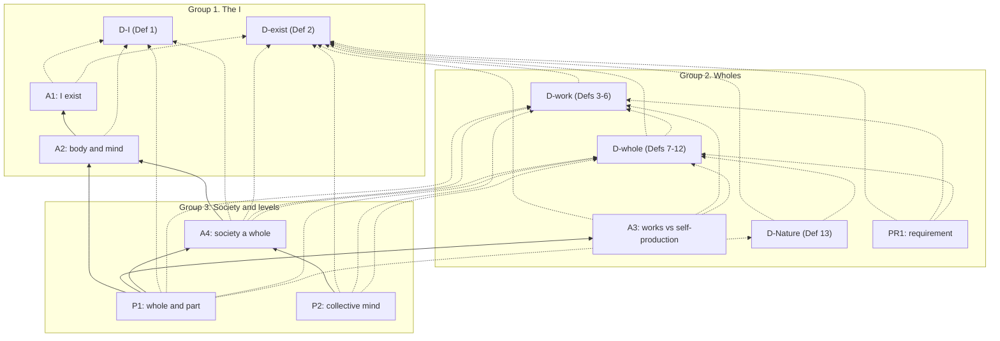

# Dependency check: core v2, one entry at a time

**What this is.** An audit of what each core v2 entry depends on. Done by hand on 1 October 2026 PT, at commit bc6a7c5, in the book's page order (README, section 1). No entry was changed by the audit itself. No scores are given.

**Status (2026-10-01, 8:11 PM PT).** The author approved all 25 fixes, with three judgment calls, and they are now applied to the core v2 entries. See the fix list, which now has a status column, and the recheck at the end. The sections between describe the entries as they stood at bc6a7c5.

**What was checked, for each entry.**

1. Every object, term or relation it uses that needs a meaning.
2. Where each one comes from:
   - **D**: defined in an earlier D-entry;
   - **E**: established by an earlier A or P;
   - **P**: taken as primitive, which the entry should say;
   - **S**: imported from a cited source;
   - **H**: defined here, in the entry itself.
3. Flags:
   - **forward**: used before it is defined;
   - **drift**: used in a sense other than its definition;
   - **undeclared**: undefined and not said to be primitive.
4. The declared dependencies (`cites` for entries, `terms` for definitions), compared with what the entry actually uses: **missing** (used but not listed) or **unneeded** (listed but not used).
5. A verdict, with the smallest wording fix for each flag.

Ordinary words that carry no weight in any argument (for example "time", "thing", "evidence") are not listed. Neither are pointers to later entries that only tell the reader where something is picked up again, such as D-I's "see D-whole, Definition 12". A pointer is not a dependency unless the entry's claim uses what it points to. Such cases are flagged.

---

## 1. D-I (Definition 1, "I")

Declared: `cites: []`, `terms: []`.

| Term | Source | Status |
|---|---|---|
| "I" | H | defined |
| thought, thinking | S (Descartes's list, AT VII 28) | fine; the list is quoted |
| thinker | P | undeclared |
| names (a word names something) | P | undeclared |
| distinct from | P | ordinary; fine |

- *Dependencies.* None declared and none needed. The mentions of A1, A2, P1 and D-whole, Definition 12, are pointers: D-I's definition uses none of them.
- **Verdict: clean, with one optional declaration.**
  - *Fix 1 (optional).* Add to the Explanation: "'Thought', 'thinker' and 'names' are taken as understood."

## 2. D-exist (Definition 2, "exist", "last")

Declared: `cites: []`, `terms: []`.

| Term | Source | Status |
|---|---|---|
| exists (of an activity) | H | defined |
| exists (of anything else) | P | declared primitive ("taken as understood") |
| lasts | H | defined |
| activity | P | **undeclared**, and load-bearing: D-work defines a work as an activity |
| going on | P | **undeclared**; D-exist defines existence by it |
| duration | S (E2D5) | fine |

- *Dependencies.* None declared and none needed. The "Where else it is used" list consists of pointers.
- **Verdict: one fix.**
  - *Fix 2.* Add after the definition: "'Activity' and 'going on' are taken as understood." D-exist already does this for "exists"; these two words carry the activity clause, and D-work uses them as well.

## 3. A1 ("I exist")

Declared: `cites: []`, `terms: [D-I, D-exist]`.

| Term | Source | Status |
|---|---|---|
| I | D (D-I) | fine |
| exist | D (D-exist, activity clause; primitive sense for the thinker) | fine |
| thinking, doubting | S (Descartes) via D-I | fine; doubting is counted as an activity, as D-exist's "What A1 uses" says |
| "an activity cannot go on while what does it, if anything does, fails to exist" | H | a bridging premise, stated, but not marked as part of the root |
| "something is doing the thinking" (Not true by definition) | — | **drift**: this is the agent sense of "doing" that the full run removed from D-I |
| "'I' in A1 names no more than that (D-I)" (Why it is certain) | — | **drift**: D-I names the thinker if there is one, so "no more than the doubting" holds only on D-I's second clause |
| "whose identification needs a subject" (`reading`) | — | **drift**: A2 no longer scores identity |

- *Dependencies.* D-I and D-exist are both used and both listed. Nothing is missing or unneeded.
- **Verdict: three small fixes.**
  - *Fix 3.* "Whenever it is thought, something is doing the thinking." → "Whenever it is thought, some thinking is going on."
  - *Fix 4.* "'I' in A1 names no more than that (D-I)" → "'I' in A1 need name no more than that (D-I, second clause)".
  - *Fix 5.* `reading`: "whose identification needs a subject that exists" → "whose description needs a subject that exists". Optionally, after the bridging premise in "In defined terms", add: "This is taken as evident with the root."

## 4. A2 (a human body, and its mind)

Declared: `cites: [A1]`, `terms: [D-I]`.

| Term | Source | Status |
|---|---|---|
| I | D (D-I); that it exists: E (A1) | fine |
| human body, cell, living | S (cell theory; Sender et al.) | fine |
| made of | H ("What 'am' claims"; cells and what cells make) | fine |
| goes with | H ("this thinking goes on with it and varies with it") | fine |
| first-person / third-person description | H ("Two descriptions") | fine |
| organization | — | **forward and undeclared**: it is in the axiom's statement, but its only gloss comes later, in D-work's Scholium |
| mind, mental abilities | — | **undeclared**: no entry defines "mind" before P2, and P2 defines only *collective* mind |
| "that same body" | — | fine: it points back to the body just named and is not D-whole's "the same whole". A reader could confuse the two, but the text does not. |

- *Dependencies.* A1 and D-I are both used and both listed. The mentions of D-whole, Definition 12, and of P1 are pointers: A2 says it does not itself claim sameness over time.
- **Verdict: two fixes.**
  - *Fix 6.* Add to "Two descriptions": "'Organization' here means how the body's components are arranged and act on one another. D-work, Scholium, gives the word the same sense, more sharply."
  - *Fix 7.* Add to "Two descriptions": "'My mind' here means this thinking (D-I) together with the abilities it is done with: perceiving, remembering, speaking."

## 5. D-work (Definitions 3–6, work and the seven works)

Declared: `cites: []`, `terms: []`.

| Term | Source | Status |
|---|---|---|
| work | H (Def 3) | defined |
| activity, going on (Def 4: "when that activity is going on in it") | D (D-exist) | **missing dependency**: D-exist is not in `terms` |
| organization | H, but only in the Scholium ("the structures and constraints that the parts impose on one another") | the definition rests on a gloss given three paragraphs later |
| structures | P | undeclared; ordinary |
| produces or maintains | S (Mossio's C2) | **drift from the source**: C2 says "produced *and* maintained"; Def 3(b) says "or", while the text says it "follows the source" |
| performs | H (Def 4) | defined |
| as one | H (Def 5) | defined, but see the next two rows |
| whole ("organization of the whole", "the whole's scale") | D-whole, Def 8 (later) | **forward** |
| member ("not only by each member", "each member was kept going") | D-whole, Def 9 (later) | **forward** |
| parts (Scholium; Def 6 rows: control, transport, signaling) | P (plain sense: components) | **drift across the core**: D-whole, Def 9, makes "part" mean *member* |
| edge, signal, information, energy, materials, damaging agent (Def 6) | P | undeclared; ordinary scientific senses |
| society, institutions (Example) | A4 (later) | an illustration only; acceptable |

- *The cycle.* Definition 5 defines "as one" using "whole" and "member". D-whole defines a whole as a thing that performs all seven works *as one* (Definitions 7 and 8), and a member as a member *of a whole* (Definition 9). So "as one" depends on "whole", and "whole" depends on "as one". It is a real circle of meaning, though a shallow one. In Definition 5, "whole" only means "the thing" and "member" only means "component".
- *Dependencies.* Missing: D-exist. Nothing is listed that is not used.
- **Verdict: five fixes.**
  - *Fix 8.* `terms: []` → `terms: [D-exist]`.
  - *Fix 9 (breaks the cycle).* In Definition 5 and the take-apart test, replace "the whole" with "the thing" and "member(s)" with "component(s)". For example: "the structures carrying out the activity are produced or maintained by the organization of the thing, not only by each component for its own sake"; "Ask what would happen if the thing's organization were removed while each component was kept going by other means."
  - *Fix 10.* Move the gloss on "organization" into Definition 3: "... which (a) contributes to keeping the thing's organization (the structures and constraints its components impose on one another) going, and (b) ..."
  - *Fix 11.* Add to the Scholium: "C2 says 'produced and maintained'; Definition 3 says 'or', so that a structure the thing maintains but did not make, such as a transplanted organ, still counts." Or change "or" to "and", if the stricter reading is preferred.
  - *Fix 12 (optional).* After Definition 6: "The words in the test questions (edge, signal, information, energy, material) are used in their ordinary scientific senses."

## 6. D-whole (Definitions 7–12)

Declared: `cites: []`, `terms: [D-exist, D-work]`.

| Term | Source | Status |
|---|---|---|
| finite | S (E1D2), H (domain clause) | fine |
| grade, profile, degree, whole | H (Defs 7–8) | defined |
| performs as one | D (D-work) | fine |
| members (Def 7: "only X's members do it") | H, Def 9 (later in the same entry) | **forward, and circular**: Def 9 defines member *of a whole*, Def 8 defines whole by the grades, and Def 7 defines the grades using members |
| persistence (Def 9) | D-exist calls it "lasting", but only in a pointer list | **drift**: D-exist defines "lasts", not "persistence" |
| depends on (Def 9) | P | undeclared; the sense is presumably D-work's counterfactual one |
| takes part in (Def 9) | P | undeclared; ordinary |
| part (Def 9: "a member (a part)") | H | clashes with the plain "parts" of D-work, A3 and PR1 (see Fix 18) |
| level | H (Def 10) | defined |
| processes (Def 11) | P | **drift**: D-work says "activities"; two words for one thing |
| boundary (Def 11: "its boundary included") | — | **equivocal**: here the physical edge (components), in D-work the boundary *work*. A3 and PR1 rely on the first. |
| organization (Def 12: "has gone on") | D-work, Scholium (structures and constraints) | **drift**: "goes on" is D-exist's word for activities, and an organization, so glossed, is not an activity. The parenthesis "(it lasted, D-exist)" gives the right sense. |
| Nature taken as one (domain clause) | D-Nature (later, and D-Nature depends on D-whole) | **forward, and a textual loop** (see "Cycles"); Definitions 7–12 do not use it |

- *Dependencies.* D-exist (lasting) and D-work (works, as one) are used and listed. Nothing is unneeded. D-Nature is mentioned, but none of Definitions 7–12 uses it.
- **Verdict: six fixes.**
  - *Fix 13 (breaks the inner circle).* Definition 7: "or only X's members do it, each for itself" → "or only X's components do it, each for itself".
  - *Fix 14.* Definition 9: "its persistence depends on" → "its lasting (D-exist) depends on". After the definition, add: "'Depends' means it would fail or change without it, as in D-work's take-apart test."
  - *Fix 15.* Definition 11: "its own processes make and replace the components that carry out those processes, its boundary included" → "its own activities make and replace the components that carry out those activities, the components of its edge included".
  - *Fix 16.* Definition 12, first bullet: "Its organization has gone on between the two times (it lasted, D-exist)." → "Its organization has lasted between the two times (D-exist)."
  - *Fix 17.* Domain clause: "Nature taken as one (D-Nature) is not finite" → "Nature taken as one, defined below (D-Nature), is not finite. This remark is not used by Definitions 7–12."
  - *Fix 18 (affects D-work, D-whole, A3 and PR1).* D-whole, Definition 9, makes "part" mean "member", while D-work, Definition 11, A3 and PR1 use "parts" plainly, for components. One of two fixes:
    - *Smallest.* Add to Definition 9: "'Part' has this sense only where the text says so (P1). Elsewhere 'parts' means components."
    - *Cleaner.* Replace the plain "parts" with "components" in D-work (the Scholium; Definition 6, rows control, transport and signaling), A3 (statement, qualifiers, negative controls) and PR1 (transport and memory bullets).

## 7. D-Nature (Definition 13)

Declared: `cites: []`, `terms: [D-exist, D-whole]`.

| Term | Source | Status |
|---|---|---|
| everything that exists | D (D-exist), mostly in its primitive sense | fine; see the optional fix |
| taken together, nothing besides | H, P | declared (a plurality, not a set) |
| finite | D (D-whole, domain clause) | fine |
| in Nature | H ("among everything that exists") | defined |
| member | D (D-whole, Def 9) | fine |
| produces itself (Scholium 3) | D (D-whole, Def 11) | fine |
| God, really one | S (E1D6, E1P14, E1P15) | declared reading, unscored |
| whole, Spinoza's sense (Scholium 1) | S (Letter 32; E2 Lemma 7 Scholium) | kept apart from the book's sense; fine |

- *Dependencies.* D-exist and D-whole are both used and both listed.
- **Verdict: clean.**
  - *Fix 19 (optional).* "everything that exists (D-exist)" → "everything that exists (D-exist; for what is not an activity, in the sense D-exist takes as understood)".

## 8. A3 (the seven works sort things the way self-production does)

Declared: `cites: []`, `terms: [D-exist, D-work, D-whole]`.

| Term | Source | Status |
|---|---|---|
| seven works, as one, grade, degree | D (D-work, D-whole) | fine |
| self-production | D (D-whole, Def 11) | fine |
| "produces its own parts" (statement, qualifiers, controls) | meant to be Def 11 | **drift**: Def 11 says "make and replace the components that carry out its activities, the edge included"; "parts" is also the word Def 9 reserves for members |
| lasts | D (D-exist) | fine |
| member (red blood cell) | D (D-whole, Def 9) | fine |
| anchors, controls, hard cases, F1–F3 | H | defined |
| cell, organism, hurricane and the like | S | fine |
| societies, AI systems | pointers (A4; D-I Scholium 2) | not used in the claim |

- *Dependencies.* All three terms are used. No A or P entry is needed. The mentions of PR1 and A4 are pointers.
- **Verdict: one fix.**
  - *Fix 20.* Statement: "A thing that produces its own parts performs all seven as one; a thing that lasts without producing its own parts fails at least one." → "A thing that produces itself (D-whole, Definition 11) performs all seven as one; a thing that lasts without producing itself fails at least one." Make the same change in the qualifiers and in the controls' "none produces its own parts".

## 9. PR1 (pattern by requirement)

Declared: `cites: []`, `terms: [D-exist, D-work, D-whole]`.

| Term | Source | Status |
|---|---|---|
| requirement | H (conditional) | defined |
| self-producing | D (D-whole, Def 11) | fine |
| the seven works | D (D-work) | fine |
| "if a thing is to last as one" (`qualifiers`, `reading`, "Two words") | — | **drift**: "as one" is defined (D-work, Def 5) only for *performing a work*, not for lasting |
| memory: "some state that carries forward how parts are made" | — | **drift**: D-work's memory work is "store information and later use it in its other works". The requirement PR1 keeps no longer matches the work it is meant to explain. |
| edge, diffusion, damaging agents, record | P, S (Segré et al.) | fine |
| A3's anchors and hard cases | E (A3, earlier) | used to explain, which adds no confidence; acceptable without a cite |

- *Dependencies.* All three terms are used. Nothing is missing, since PR1 explains and is not supported by A3.
- **Verdict: two fixes.**
  - *Fix 21.* "if a thing is to last as one" → "if a thing that produces itself is to go on producing itself". Apply this in "Two words", the qualifiers and the `reading`.
  - *Fix 22.* First memory bullet: "Some state that carries forward how parts are made" → "Stored information about how its components are made, used again in rebuilding them". Keep the rest: anything that rebuilds its components has this, so the requirement is nearly empty, and the information need not sit in a separate record. This brings it in line with D-work's memory work.

## 10. A4 (the society I live in is a whole to a degree)

Declared: `cites: [A2]`, `terms: [D-I, D-exist, D-work, D-whole]`.

| Term | Source | Status |
|---|---|---|
| society | H (declared reading) | defined |
| institution (declared reading; take-apart tests; Scholium) | — | **undeclared**, and now load-bearing: the take-apart test disperses "the institutions that carry each work" |
| government, state, territory | P | ordinary; fine |
| member, whole, degree | D (D-whole) | fine |
| as one, take-apart test | D (D-work, Def 5) | **drift in one row**: in the energy row, "most members could not feed themselves alone" is the old taking-apart procedure. Definition 5's test keeps the members going by other means. |
| I, this body | D (D-I), E (A2, clause a) | fine |
| persistence (Membership) | D-exist, as lasting | the same drift as Fix 14 |

- *Dependencies.* A2, D-I, D-exist, D-work and D-whole are all used. Nothing is missing or unneeded. The mention of PR1 is a pointer.
- **Verdict: two fixes.**
  - *Fix 23.* Add to the declared reading: "An *institution* is a lasting arrangement of people and rules through which a work is carried out: a court, a market, a school, a family."
  - *Fix 24.* Energy row: "*Take apart:* most members could not feed themselves alone." → "*Take apart:* remove the organization of the food and power systems while each member is kept going by other means, and no one converts energy for the society as a whole." Then: "That most members could not feed themselves alone bears on membership (D-whole, Definition 9), not on 'as one'." Spencer's quotation follows unchanged.

## 11. P1 (a whole at one level, a part at the next)

Declared: `cites: [A2, A3, A4]`, `terms: [D-I, D-work, D-whole, D-Nature]`.

| Term | Source | Status |
|---|---|---|
| I | D (D-I) | fine |
| human body made of cells | E (A2, clause a) | **gap in step 1** (below) |
| produces itself, performs as one | D (D-whole, Def 11; D-work), E (A3) | fine |
| whole, member (= part), level, same whole | D (D-whole, Defs 8–10, 12) | fine; "part" is used in Def 9's sense, as the `reading` says |
| society, membership | E (A4) | fine |
| Nature (Scholium 3) | D (D-Nature) | used in a scholium only |

- *The gap.* Step 1 reads "I am a human body made of cells (A2; 'am' as A2 scores it, Scholium 4), so I am a multicellular organism." On the reading A2 scores, I am *made of* this body and this thinking *goes with* it. "So I am a multicellular organism" follows only on the identity reading, which A2 declares and does not score. Scholium 4 states the scored conclusion correctly: the body I am made of is the whole. The demonstration's own steps 1–3 and 8 do not.
- *Dependencies.* A2, A3 and A4 are each used (steps 1, 2 and 5). D-I, D-work and D-whole are used. D-Nature is used only in Scholium 3. That is fine if `terms` covers scholia, as the core has assumed so far; nothing is missing.
- **Verdict: one fix.**
  - *Fix 25.* Step 1 → "This thinking goes with a human body made of cells, the body I am made of (A2, clause (a)). That body is a multicellular organism." In steps 2–4, "I" or "my" becomes "this body" or "its" where the step is about the organism. Step 8 → "So this body, the one this thinking goes with, is a whole at one level and a part at the next; on A2's declared reading, so am I (Scholium 4)." The statement stays as it is, read through Scholium 4.

## 12. P2 (a collective mind happens)

Declared: `cites: [A4]`, `terms: [D-exist, D-work, D-whole]`.

| Term | Source | Status |
|---|---|---|
| collective mind | H ("What the name means") | defined |
| control, signaling, memory, as one | D (D-work, Defs 5–6) | fine |
| society | E (A4) | fine |
| degree by the lowest grade (step 4) | D (D-whole, Def 8), applied by P2's own stipulation ("by the same rule") | fine; the text marks it as a stipulation |
| activity, exists while it goes on (step 5) | D (D-exist) | fine |
| first-person description (step 6) | E (A2), reached through A4's cite of A2 | fine |
| Spinoza's mind, individual (Scholium 4) | S (E2P13) | declared undecided; fine |
| A3's anchors (Scholium 1) | E (A3) | a scholium only; adds no support; fine |

- *Dependencies.* A4 is used. D-exist, D-work and D-whole are used. Nothing is missing or unneeded.
- **Verdict: clean.**

---

## Cycles (as found, before the fixes)

**In the declared fields: none.** Every `cites` and `terms` edge points to an entry earlier on the page (check K1 of collision_order, re-run for this audit). Since the edges only point backward, no chain of dependencies can come back to where it started.

**In meaning: one real cycle, in two places.** Both are broken by changing words, not by changing the order.

1. *D-work ↔ D-whole.* "As one" (D-work, Def 5) is defined using "whole" and "member"; "whole" and "member" (D-whole, Defs 8–9) are defined using "as one". Fix 9.
2. *Inside D-whole.* Grades (Def 7) use members; members (Def 9) are members of a whole; wholes (Def 8) are defined by grades. Fix 13.

**In the text only: loops of mention, not of support.**

- *D-whole ↔ D-Nature.* D-whole's domain clause mentions D-Nature, and D-Nature uses D-whole's domain clause. Definitions 7–12 do not use the remark. Fix 17 marks it as a forward note.
- *A3 ↔ PR1.* A3 says "whether they are required is PR1's thesis"; PR1 explains A3's anchors. PR1 adds no confidence, so nothing supports itself here.
- *Forward pointers.* D-I, A1 and A2 point ahead to D-whole, Definition 12, and to P1, step 6, to say where sameness over time is handled. They say explicitly that they do not claim it.

**Graph (after the fixes).** Solid arrows are `cites` (support); dotted arrows are `terms` (meaning). Arrows run from the entry that uses to the entry used. Before the fixes, the D-work to D-exist arrow was missing from `terms` (Fix 8), and a red dashed arrow ran from D-work back to D-whole: Definition 5 used "whole" and "member" (Fix 9). That arrow is gone. Every arrow now points to an entry earlier on the page.

---

## The v11 verse notes that point to entries

| Note | Points to | Exists? | Says what the entry says? |
|---|---|---|---|
| 56 | "the core_v2 candidate A1, 'I exist'"; 57; 137; 153 | yes | Yes. core_v2 A1 is "I exist." The committed `entries/A1.md` is still "I, a human, exist", and the note says that wording stays. |
| 149 | HOW_THIS_BOOK_IS_BUILT §§3–5; entry candidate 12; 56 | yes | Yes. Candidate 12, in the verse file's own table, says that only A1 is exempt. HOW still gives the root as "I, a human, exist", and the note's "strictly 'I exist'" is the note's own qualifier, not something HOW says. |
| 82 | entry candidates 5a, 5b, 6a, 6b | yes, as rows in the verse file's own candidate table (Part Three); none is in `entries/` or core_v2 | Yes. 5a is Spinoza's text, covering 82 among others; 5b is freedom by degrees (87, 95); 6a is the networks (78); 6b is the triple network (84). The note now calls 5a a source, not evidence, which matches the table's tier ("textual"). |
| 130 | E4P35; 38, 121–122 | yes | Yes. E4P35 matches Elwes: "In so far only as men live in obedience to reason, do they always necessarily agree in nature." The note says the bridge is named, not argued, which is true. |
| 160 | PR1; A3; 28, 38–39 | yes | **Against `entries/`: yes.** Committed A3 claims the seven works for cell, person and society, and committed PR1 says the same requirement holds at every scale. **Against core_v2: out of date.** There, the society claim is A4, not A3, and PR1's requirements are sorted, with transport, signaling and defense required only in some circumstances, so "the same requirements" says more than core_v2's PR1. If core_v2 is promoted, note 160 should say "A4" and "requirements, some holding only in some circumstances". **Done, 2026-10-01 PT:** note 160 now says both; verse 149 is left as it is until core v2 is promoted. |

---

## Proposed fixes, in one list

Each is the smallest wording change that clears its flag. All 25 were approved by the author on 2026-10-01 at 8:11 PM PT and are applied.

| # | Entry | Fix | Kind | Status |
|---|---|---|---|---|
| 1 | D-I | Declare "thought", "thinker", "names" as understood | optional | applied |
| 2 | D-exist | Declare "activity", "going on" as understood | undeclared primitive | applied |
| 3 | A1 | "something is doing the thinking" → "some thinking is going on" | drift | applied |
| 4 | A1 | "names no more than that" → "need name no more than that (D-I, second clause)" | drift | applied |
| 5 | A1 | `reading`: "identification" → "description"; mark the bridging premise as part of the root | drift | applied: "description"; the bridging premise is "taken as evident with the root" |
| 6 | A2 | Gloss "organization" where it is first used | forward use | applied |
| 7 | A2 | Gloss "my mind" as this thinking and the abilities it is done with | undeclared | applied (judgment call b): "this thinking (D-I) together with the abilities it is done with: perceiving, remembering, speaking" |
| 8 | D-work | Add D-exist to `terms` | missing dependency | applied |
| 9 | D-work | Def 5 and test: "whole" → "thing", "member" → "component" | **cycle** | applied; the Example now uses the same counterfactual test |
| 10 | D-work | Move the "organization" gloss into Def 3 | forward use within the entry | applied; the Scholium points back to Definition 3 |
| 11 | D-work | Note that "or" departs from Mossio's "and" (or change to "and") | drift from source | applied (judgment call a): "or" is kept, with a note that a transplanted organ still counts |
| 12 | D-work | Declare the test-question words ordinary | optional | applied |
| 13 | D-whole | Def 7: "members" → "components" | **cycle** | applied; the recheck found two more uses in Definition 7 and fixed them (see below) |
| 14 | D-whole | Def 9: "persistence" → "lasting (D-exist)"; gloss "depends" | drift, undeclared | applied; "depends" glossed by the take-apart test |
| 15 | D-whole | Def 11: "processes" → "activities"; "boundary" → "the components of its edge" | drift, equivocation | applied |
| 16 | D-whole | Def 12: "organization has gone on" → "has lasted" | drift | applied |
| 17 | D-whole | Mark the D-Nature remark as a forward note not used by Defs 7–12 | textual loop | applied: "defined below ... This remark is not used by Definitions 7–12" |
| 18 | D-work, D-whole, A3, PR1 | "part" (= member) vs plain "parts": add one sentence to Def 9, or use "components" for the plain sense | equivocation | applied (judgment call c): "components" for the plain sense, in D-work, D-whole, A2, A3, PR1, A4 and P2; Definition 9 adds that, except in quotations and reports of other authors, "part" means member |
| 19 | D-Nature | Say which sense of "exists" is meant | optional | applied |
| 20 | A3 | "produces its own parts" → "produces itself (D-whole, Definition 11)" | drift | applied |
| 21 | PR1 | "last as one" → "go on producing itself" | drift | applied |
| 22 | PR1 | Memory requirement restated in D-work's terms (stored information, used again) | drift | applied; the memory bullet now says it is D-work's memory work applied to rebuilding |
| 23 | A4 | Define "institution" | undeclared | applied |
| 24 | A4 | Energy row: use Def 5's test; Spencer's point bears on membership | drift | applied; "for the society as a whole" avoided ("at the society's own scale") |
| 25 | P1 | Step 1 and step 8 on A2's scored reading: "this body", not "I" | gap | applied; the statement is unchanged; step 8 ends on A2's declared reading |
| — | verse note 160 | Update to core_v2's A4 and sorted PR1 when core_v2 is promoted | out of date against core_v2 only | applied now, at the author's request; verse 149's text is unchanged |

---

## Recheck after the fixes (2026-10-01 PT)

Done quickly, by hand, on the edited entries, in page order, with the same questions as above. No scores.

**The circle is broken.**

- *D-work, Definition 5,* now reads: "the structures carrying out the activity are produced or maintained by the organization of the thing, not only by each of its components for its own sake, and not only by something outside the thing." The take-apart test speaks of the thing, its organization and its components. D-work no longer uses "whole" or "member" anywhere. "Organization" and "component" are both glossed in Definition 3, so "as one" rests only on D-work's own earlier definitions and on D-exist.
- *D-whole, Definition 7,* grades a thing using "as one" (D-work) and "components" only. Definition 8 defines a whole by the grades, and Definition 9 defines a member by a whole. The chain runs one way, 7 → 8 → 9, and does not come back.
- *Declared fields (check K1).* Scanned from `terms` and `cites` in page order. Every edge points to an earlier entry. D-work's new `terms: [D-exist]` points backward. All twelve frontmatters parse.

**New issues found by the recheck, all fixed in the same commit.**

1. *Fix 13 was incomplete.* Definition 7's grade 1 still said "for some of its members, or with its members often working against it", and grade 2 said "across the whole". Both used words defined later in the same entry, so the inner loop was still open. They now say "components" and "across all of X".
2. *"Component" was undeclared.* Fix 18 made "component" carry the plain sense everywhere, but no entry said what it means. Definition 3 now says: "a *component* is any piece of the thing, in the plain sense". Definition 9 points back to it.
3. *A pointer drifted.* A2's new gloss pointed to D-work's Scholium for "organization". Fix 10 moved that gloss into Definition 3, so the pointer now says Definition 3.
4. *P1, step 6* still said "its works have gone on with no full stop", after Fix 16 changed Definition 12 to "has lasted". It now matches: "its organization has lasted with no full stop".
5. *P2, step 2.* After Fix 18, "its components" had no antecedent, and "each member for themselves" no longer matched Definition 5's "each of its components". Now: "signals from a thing's components", "performed as one by the society", "each person for themselves".
6. *A4, energy row.* The new take-apart sentence first said "for the society as a whole", which uses the word A4 is trying to establish. It now says "at the society's own scale".
7. *Leftover plain "part".* A2 ("the empirical part", "it is part of the declared reading"), PR1 ("one part's state"), D-exist's pointer list ("producing their own parts") and two README rows were changed to "clause", "belongs to", "component" and "produces itself".

**Left as they are, on purpose.**

- "Part" still appears in quotations and reports of other authors: Spinoza in D-Nature, Scholia 1 and 2, and in D-whole's sameness scholium; Mossio's C3 in D-work's Scholium. Definition 9 now makes that exception explicit.
- P1's title and statement ("a part at the next") and A3's "a thing can be a part without being a whole" use "part" in the member sense, as Definition 9 allows.
- A4's failure clause says a row fails if the work is done "only by members separately". A society's members are among its components, so this is narrower than Definition 7, not in conflict with it.
- Verse 149 still reads "I, a human, exist", at the author's instruction, until core v2 is promoted.
